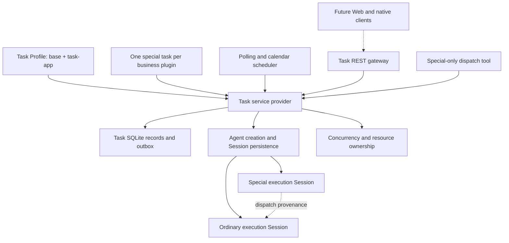
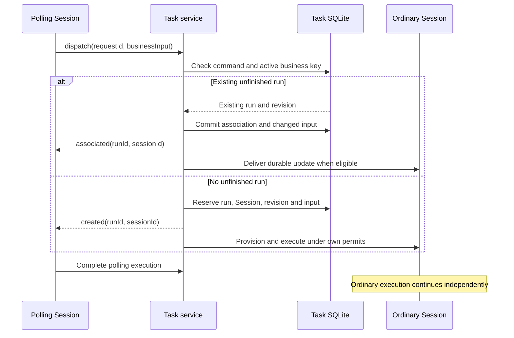

# Agent Note: Task Profile and recoverable business execution

Status: proposed

English | [中文](2026-09-09-task-profile.zh.md)

## Problem

Personal automation needs to discover assigned defects and requirements, prepare periodic reports, and execute manually requested work while a local DSH service stays available without an open browser. These operations combine model reasoning, tools, human decisions, and external writes across multiple conversations and process restarts. Repeated discovery must reach existing unfinished work instead of creating concurrent handlers for the same business object.

A Session records conversation history but does not define business completion. Session-local reminders require a live owner; runtime subagents depend on parent ownership; current Workflow executions do not checkpoint business stages. A reusable task system needs explicit scheduling, execution identity, completion, recovery, and plugin ownership without embedding individual business systems into DSH.

## Confirmed independent Task application design

Current delivery and acceptance cover the Task backend: `base + task-app`, the unmodified Host WebServer and Credentials, Task-owned runtime providers, and `/api/task/v1` on port 3081. Business plugins, Task Web UI and native client applications are deferred work. UI descriptions below are future requirements, not current acceptance criteria. A future Task Web UI must remain independent of Cordis client plugins and consume the common gateway; business plugins must not ship frontend components. Original Base, Web App and shared provider sources remain unchanged.

The public gateway owns `/api/task/v1`, REST JSON operations, two resumable SSE feeds, OpenAPI 3.1 generated from runtime Zod schemas, RFC 9457 errors, pagination and stable DTOs. Commands carry idempotency keys and optimistic revisions. Durable receipts survive restart; different content under the same key conflicts. Cancellation acknowledges admission with 202 and completes asynchronously. The Fetch client is Cordis-free. API times use UTC RFC 3339; existing internal timestamp storage need not change. Internal checkpoints and operation receipts never become public Run fields. Forward-compatible clients ignore unknown response fields while the gateway validates its own emitted DTOs strictly.

Task and Session feeds use distinct durable cursors. Subscribe-before-baseline prevents lost updates. Queues are bounded by bytes and count; slow consumers reconnect and repair from durable records. A resync notification is best effort: an already saturated socket cannot be required to accept one more frame. Final model messages are durable; transient tokens carry no durability promise. Session, interaction and tool content are projected deterministically without a second conversation store.

Browser launch tokens are single-use with a 60-second lifetime and exchange for signed 30-day HttpOnly cookies. Cookie writes require CSRF and Host/Origin checks. Device bearer tokens are revocable and stored as digests; native clients keep values in their operating-system credential storage. Default binding is loopback with no cross-origin browser access. Shared credentials use references, write-only mutation and value-free status. Logs and diagnostic DTOs never include raw bodies, Cookie, Authorization or resolved credentials. Business content in Session and backup files remains private user data; schema validation cannot prove arbitrary text contains no secret.

Business plugins register one stable definition ID and only business/configuration logic. Self-contained Draft 2020-12 schemas, bounded built-in widget hints, localized text, optional configuration checks and dynamic option sources drive common forms. No remote schema references, scripts, custom components or plugin HTTP routes are allowed. The gateway owns catalog discovery for Task presets, permissions and models. Configuration saves validate revision and schema version, affect future Runs only, and recompute scheduling. Existing Runs retain their original configuration and schema snapshots; references resolve current credentials per external operation. Deterministic configuration migration gates new admission, while Run recovery requires declared code/checkpoint compatibility.

A retirement transaction closes admission, aborts stages and drains owned operations before cleanup. The old package remains installed until cleanup succeeds. Failure leaves retirement blocked and resources locked; a timeout is not evidence that an asynchronous operation stopped. Cleanup cannot race an operation that still owns resources. Package removal follows quiescence, and upgrade registers the new version only after the old version retires. Restart uses retained code to recover cleanup. Normal Host shutdown preserves executable Runs and their business resources for recovery; it does not apply plugin-uninstall cancellation to every task.

Interactions share a public projection for business waits, tool approval and Agent questions, with source, identity, revision, schema and optional expiry. The first valid response wins; later stale responses conflict. Expiry delivers one durable timeout input for the plugin to interpret. Displaying an outstanding approval must not overwrite the engine stage state or prevent the awaiting stage from resuming. Persisted recovery must reconstruct pending approvals before promising cross-restart responses. Permission policy remains authoritative. Terminal Sessions are read-only, and cancellation refuses further input.

The future shared UI is separately scoped and will consume the public API for configuration, execution history, Session interactions and attachments. No frontend code or browser acceptance is required for the current backend delivery.

Attachments use authenticated multipart upload and scoped opaque IDs, with digest-based storage under `tasks/attachments`, explicit Run/Session ownership, bounded uploads and Range downloads. Unreferenced upload staging and completed immutable blobs have distinct lifetimes. Notifications use durable identity-based deduplication with a log provider and a future provider interface; external business integrations remain outside this repository.

Startup acquires the process lease, migrates the monotonic database schema, restores Session state, waits for the initial Loader tree, reconciles plugin compatibility and then enables scheduling. Empty business catalogs are valid. Live and Ready probes disclose only minimal status. Readiness depends on successful recovery and scheduler availability. Core event logs correlate request, definition, Run, Session and operation identities without raw business payloads. Supervisors collect stderr and rotate logs.

Defaults are configurable: four admitted stages, one-second scheduler tick, 30-second cancellation grace, two-minute cleanup and shutdown deadlines, 30-second JSON request timeout, 60-second config check timeout, 15-second SSE heartbeat, 512 events or 2 MiB per SSE queue, pages of 50 up to 200, 1 MiB JSON bodies, 50 MiB files and 200 MiB upload requests. Priority aging adds one per waiting minute, capped at 100; resource-blocked work consumes no execution slot. Equal priorities remain FIFO.

Maintenance uses the existing `dsh --profile task` launcher for backup, restore and token administration. With the Task host stopped, backup acquires its exclusive owner lock, copies the database through SQLite's backup mechanism, and pins exact Session generations and byte prefixes plus immutable attachment and preset blobs. A complete manifest includes hashes and versions; partially written output never appears complete. External operations are reconciled on restoration, not treated as rolled back by a file backup. Credentials are excluded. Restore requires an inactive Host and empty target, validates the complete manifest before publication and does not overwrite existing user data. OS service examples are documented without automatically installing them.

Only the old default Task profile tuple migrates to `base + task-app`; custom tuples and user patch files retain user ownership. SQLite migration retains Task data without rewriting Session JSONL. Backend completion requires behavior tests, protocol artifacts, recorded model output, source and built profile tests, migration/recovery fixtures and protected-source checks. Task Web UI and client application acceptance remain deferred.

Command admission uses the Task database transaction rather than a separate gateway receipt database. Savepoints compose existing mutations without publishing rolled-back audit events or cancellation signals. Receipts retain original response snapshots and compare JSON content independently of object field order. Principal-scoped keys prevent device retries from colliding with another caller; configuration and enable changes share optimistic definition revisions. This establishes engine admission semantics; HTTP authentication and DTO projection belong to the gateway; frontend integration is deferred.

The Task Profile mounts `task-api-gateway` on the shared WebServer without changing that provider. Credentials holds a versioned Task grant with single-use launch digests, signed browser sessions and revocable device digests. HTTP commands use the same atomic Task admission as local callers; the consumer projects public fields and rejects Host, Origin, CSRF and request-size violations. Definitions without declared schemas use schema version zero. The profile does not mount a UI.

Task SSE uses the existing durable journal instead of a second notification store. SQLite bounds each replay page; a ready cursor establishes subscription before REST snapshot acquisition. Clients retain only delivered cursors and repair after reconnect. Per-connection byte limits, drain deadlines and connection admission bound gateway memory. Credential revocation is observed before subsequent replay batches. This feed carries Task notifications; Session streaming uses a separate endpoint and cursor.

Task transcript reads use bounded asynchronous persistence reads rather than the shared history controller. That controller prepares cold Sessions, which conflicts with the Task mutation guard for terminal executions. Read handles preserve the guard and avoid adding deprecated synchronous event reads. Continuations verify their previous stored record, reject unavailable history and expose only append-origin conversation content. The persistence provider owns buffering and may still materialize a complete log internally; the gateway does not introduce a second transcript store. Real Task Profile coverage verifies terminal reads leave execution state unchanged.

## Proposal

Add a Task Profile composed from Base and a task application bundle. Each business plugin registers exactly one executable special task: polling, calendar-scheduled, or manual. Only a special execution can dispatch ordinary executions; each ordinary execution inherits the dispatcher's preset and executes independently in its own Session. Business plugins define stages and completion rules; the Task service owns durable admission, scheduling, execution management, and observation.

The following design records requirements for business plugins and future clients. The [Task application decision](../../implemented/architecture/2026-09-13-task-independent-application.md) and package references own shipped behavior; a design statement below does not override them. The implementation entry is the named `task` profile through the existing `dsh` launcher; no new package executable is introduced.

### Scope and outcomes

The first deployment is one user and one continuously running local Host. Closing a browser does not stop work. An operating-system supervisor can restart the Host; a sleeping or powered-off machine cannot execute work, so wake and startup reconcile missed triggers. Distributed workers, multi-user authorization, automatic installation of business code by a model, and detailed Task page layouts are outside this design.

DSH owns the generic service, scheduler, persistence, extension API, and profile. A separate personal business repository owns the ZenTao, Meegle, report, and performance plugins and their reusable Gerrit tools. Existing scripts may perform external operations, but the business plugin owns durable stage control. No business operation is executed by this documentation change.

### Contents

- [Architecture and existing components](#architecture)
- [Domain model and invariants](#domain)
- [Plugin API and stage execution](#plugins)
- [Storage and Session consistency](#storage)
- [Dispatch, updates, and recovery](#execution)
- [Scheduling and resource control](#scheduling)
- [Configuration, lifecycle, and cleanup](#lifecycle)
- [Web integration and business migration](#integration)
- [Remaining integrations](#implementation)
- [Acceptance criteria](#acceptance)

## Architecture and existing components

The Task service is the only authority that admits task work. Timers, Web controls, and model tools call that service rather than creating Agents directly. Business ownership belongs to the registered plugin, while the dispatch relation records provenance between executions.

### Proposed package responsibilities

The package split follows independently evolving roles. Scheduler algorithms, SQLite transactions, resource admission, and the Session adapter initially remain modules inside the local provider; they do not each become a new public service.

| Proposed package and location | Responsibility |
| --- | --- |
| `@deepseek-ai/dsh-task`, `packages/task/task` | Cordis `TaskService` Service Definition, `ctx.tasks`, branded identities, registration and execution types, error codes, and browser-safe data exports. |
| `@deepseek-ai/dsh-task-local`, `packages/task/task-local` | Service Provider: registry, SQLite storage, scheduler, stage driver, Session adapter, resources, recovery, and owned runtime invariants. |
| `@deepseek-ai/dsh-task-api-gateway`, `packages/task/task-api-gateway` | Consumer: authenticated REST operations and resumable SSE; validates requests and routes Task-owned Session mutations. |
| `@deepseek-ai/dsh-tool-task-dispatch`, `packages/task/tool-task-dispatch` | Consumer: model-facing dispatch and association through a special execution's authority, with pure Host presentation. |
| Task Web UI / native applications | Deferred shared Web UI and native applications consume the gateway; no client plugin package is part of the backend. |
| `@deepseek-ai/dsh-task-app`, `packages/bundle/task-app` | Ordered patch layer assembling Task services and the API gateway over Base; owns Task-specific startup/shutdown integration. |

Business plugins consume `ctx.tasks` to register their special task and implement both special and ordinary execution handlers when dispatch is supported. Several plugins may reuse a library or a Gerrit tool package, but one business registration cannot expose several special task definitions. A distribution bundle may install several separately owned plugins.

### Existing reuse and required additions

| Existing owner | Reuse | Required addition or limitation |
| --- | --- | --- |
| [Profile loader](../../../../packages/boot/app-boot/src/profile.ts) and [Web bundle](../../../../packages/bundle/web-app/README.md) | Named profiles, ordered patches, Host/Client composition. | Add the Task template and bundle dependencies. Live reload must distinguish configuration updates, service shutdown, and business removal. |
| [Agent registry](../../../../packages/core/agent/src/index.ts) | Caller-owned create/resume handles and setup before publication. | Task retains handles under business ownership; generic Session activation must consult the task owner. |
| [Agent preset registry](../../../../packages/preset/agent-preset-registry/README.md) | `composeFrom()` inherits the same live composition revision. | Queued children and restart need durable revision selection; preset IDs and in-memory revisions do not provide that guarantee. |
| [Session inbox](../../../../packages/core/agent-loop/src/inbox.ts) | Identified messages and durable inbox splices. | Task delivery reconciles stable IDs against persisted receipts, admission, and cancellation; `followup()` alone is not an acknowledgement protocol. |
| [Schedule](../../../../packages/schedule/schedule/README.md) | Reference for clocks and timer teardown. | It targets a live conversation with fixed intervals; Task needs service-owned triggers and new Sessions. |
| [Workflow](../../../../packages/workflow/workflow/README.md) and [Jobs](../../../../packages/jobs/jobs/README.md) | Optional operations within a stage, subject to their own lifetime. | Neither is the durable outer Task supervisor. |
| [User approval](../../../../packages/interaction/user-approval/README.md) | Existing interaction presentation and audit conventions. | Host restart requires persisted business waits and reconstruction, not preservation of a live Promise. |
| [Domain storage](../../../../packages/storage/storage-domain/README.md) | JSON validation and durability conventions. | Existing KV operations have no multi-record transactions or secondary indexes; Task needs transactional admission and an active-key constraint. |

The [Task Surface proposal](../feature/2026-08-04-task-surface.md) concerns a temporary interaction within a Session. [Session-local reminders](../../implemented/feature/2026-08-05-durable-web-schedule.md), [dynamic Workflow](../../implemented/feature/2026-07-05-dynamic-workflows.md), and [Agent Teams](../../implemented/feature/2026-08-05-agent-teams.md) retain their independent ownership and use cases. This proposal does not supersede those records or make their deferred capabilities available.

## Domain model and invariants

A task definition is registered code and configuration. A trigger occurrence is one request to execute that definition. A run is one admitted execution with exactly one reserved Session identity. A phase is a plugin-defined business stage; a turn is a model interaction within that execution. These identities are not interchangeable.

| Entity | Identity and required facts |
| --- | --- |
| `TaskDefinition` | Stable plugin-owned `definitionId`; special kind; availability; current configuration, schedule, and code revisions. |
| `TriggerOccurrence` | `occurrenceId`, definition, cause, schedule revision, intended instant or manual request ID, admission decision, and optional run ID. Skipped triggers have no run or Session. |
| `TaskRun` | `runId`, unique `sessionId`, definition, special/ordinary kind, original parent run for ordinary work, business key, revision snapshot, status, phase checkpoint, timestamps, and result. |
| `RunAssociation` | Immutable source run, target run, dispatch request ID, discovery time, and observed business version; later discoveries never replace the original parent. |
| `RunInput` | Stable input ID, source, observed business version, data, delivery state, and Session message identity when model-visible. |
| `PhaseCheckpoint` | Plugin schema version, phase ID, attempt, JSON state, operation intents/results, pending wait, and expected run revision. |
| `ExecutionRevision` | Immutable resolved business configuration, plugin package identity/version, preset manifest and content digests, and credential references. |
| `ResourceRecord` | Owner run or shared owner, kind, safe locator, acquisition identity, cleanup policy, and cleanup progress. |

Opaque IDs use `Branded<B>` from the existing brand library. The plugin supplies the business key, such as a defect ID or requirement ID; the system scopes it by stable definition identity. A plugin addressing several external systems must include the required instance discriminator in its key. Changing the key algorithm requires explicit migration or draining existing runs.

### Required invariants

1. One registration owns one special definition; ordinary runs always name an existing source special run from the same definition.
2. A partial unique constraint permits at most one nonterminal ordinary run per `(definitionId, businessKey)`, including provisioning, queueing, blocking, retry, cancellation, and recovery.
3. A run never changes Session ID. Session creation failures retain the reserved ID and retry provisioning rather than allocating a replacement.
4. Ordinary runs inherit the source execution revision and preset; they receive no dispatch authority and cannot create further Task runs.
5. Parent completion and parent-run cancellation do not cancel ordinary runs. Removing the owning business plugin cancels all of its special and ordinary runs.
6. Business completion is explicit. Agent idle, an empty inbox, a final assistant message, and tool success are insufficient by themselves.
7. Terminal runs cannot accept business input or return to an active state. Later discovery may create another run with a new Session.
8. Every model-visible business input and stage instruction is reconstructable from Session events; SQLite-only context cannot silently enter a request.
9. At most one Host owns a task database and at most one driver owns a run. Old callbacks cannot mutate a newer run revision or registration generation.
10. No completed cleanup record claims a live owned process or a successfully deleted resource whose deletion failed.

### Execution states

Business phase and scheduler state are separate fields. Plugins choose business phases without inventing scheduler states; the provider validates every transition with an expected revision.

| State | Meaning and exit |
| --- | --- |
| `provisioning` | Run and Session ID are reserved; create or reconcile the Session before admitting executable work. |
| `queued` | Ready input or next stage awaits execution permits and resources. |
| `running` | One stage activation owns its permits and cancellation signal. |
| `waiting_input` | A persisted business question or confirmation awaits a version-matched response. |
| `waiting_retry` | A recoverable error has a plugin-selected retry instant and attempt limit. |
| `blocked` | Credentials, a missing dependency, uncertain external result, or another explicit condition needs resolution. |
| `recovering` | Startup reconciles persisted state, Session delivery, resources, and plugin checkpoint before resumption. |
| `cancelling` | Admission is closed; owned operations are stopping and cancellation cleanup is in progress. |
| `succeeded`, `failed`, `cancelled` | Immutable outcomes. `failed` means the plugin's final failure rule or an explicit unrecoverable runtime failure, not a transient exception. |

Every transition records its cause and time. Cleanup has its own `pending/running/blocked/complete` status: a successful business result can coexist with failed artifact cleanup. The active-key slot remains held while executable side effects can still occur; terminal settlement waits for runtime quiescence, while a cleanup tombstone can retain resource reservations afterward. A new run for the same business object must wait for any conflicting retained resources.

## Plugin API and stage execution

The service exposes a typed registration API, not an executable workflow document supplied through Web. Installed business code is trusted Cordis code. Configuration and business payloads remain validated data; a model cannot register code, change its task kind, choose another plugin owner, or supply an arbitrary preset on dispatch.

### Registration and control operations

The following signatures describe proposed operations rather than compiling declarations. Public implementation types must distinguish host-only handles from wire data and document parameters, results, disposal, and error outcomes.

| Operation | Caller and semantics |
| --- | --- |
| `register(owner, definition) -> disposer` | Business plugin; `owner` is its exact Cordis context and each plugin instance contributes exactly one stable definition. Registration validates configuration, handler availability, preset, schemas, resources, and schedule before opening admission. The disposer closes admission synchronously and returns awaited asynchronous teardown. |
| `updateConfig(id, expectedRevision, patch)` | Configuration controller; validates and records a new revision, without mutating a running execution's snapshot. |
| `setEnabled(id, enabled, expectedRevision)` | Stops or resumes future triggers; disabling alone leaves admitted executions running. |
| `triggerManual(id, requestId, input)` | Human-facing controller for a manual definition; request ID makes transport retries idempotent. Input is checked against the plugin schema. |
| `dispatch(authority, requestId, businessInput)` | A live special run's code or tool; computes the plugin business key and atomically associates or creates ordinary work. Returns `created` or `associated`, target run/Session IDs, and accepted input revision. |
| `respond(runId, waitId, expectedRevision, response)` | Human-facing controller; validates the pending wait and persists the response before acknowledging it. |
| `sendInput(runId, requestId, input)` | Human-facing controller; queues a business input for an unfinished run without bypassing stage validation. |
| `cancel(runId, requestId)` | Human-facing controller or plugin; closes run admission, persists intent, and begins cancellation. Acceptance is distinct from cleanup completion. |
| `listDefinitions`, `listRuns`, `getRun`, `observe` | Read consumers; cursor pagination, filters, revisioned snapshots, and changes after a committed cursor. |

A registration contains `kind`, input/checkpoint/result schemas, the preset declaration, `runSpecial`, optional `runOrdinary`, `businessKey`, `compareUpdate`, `resume`, `classifyError`, `priority`, `resources`, and `cleanup`. Hooks are required only for their declared capabilities: a plugin that dispatches must supply its ordinary handler and key function; one that receives durable data must decode its checkpoint version. These are extension methods on one registration, not separately configurable ordinary task definitions.

All registrations use `ctx.effect()` and return their disposer. A stable identity survives disable/re-enable and process restart; an activation generation changes when code is unloaded. Duplicate definitions fail explicitly rather than replacing a registration by last-writer wins.

### Durable stage protocol

A stage activation receives an immutable run/configuration snapshot, the persisted checkpoint, an ordered input batch, its cancellation signal, and runtime-owned capabilities. It returns one durable decision: advance to a named phase, wait for input, wait until a retry time, block with a reason, succeed with a result, or fail with a final error. It never holds a JavaScript call stack across a long human wait.

The provider commits consumed input IDs, next checkpoint, status, and pending commands together under `expectedRevision`. Duplicate completion from an older activation is rejected. Plugin checkpoint JSON has its own schema version; unknown versions block recovery with a precise compatibility error. A phase may run several model turns, but the provider does not treat any arbitrary turn boundary as phase completion.

A proposed `run.model(operationId, request, completionRule)` capability prepares and records phase input, starts work through the existing Agent interface, and correlates accepted messages and committed output with that operation. It uses a durable input identity and explicit completion evidence, such as a plugin-validated structured capture or a named business result. `whenIdle()` is only a quiescence check after correlation. Cancellation before admission and an empty/rejected pre-step must settle without hanging or pretending a result exists.

External actions use a recorded operation ID and states `prepared`, `confirmed`, or `uncertain`. The plugin records the intent before invoking a script, stores a validated receipt afterward, and provides reconciliation for uncertain results. The system guarantees idempotent task admission and durable intent; it does not promise exactly-once external writes. For example, a Gerrit push with a lost response is checked by Change-Id and commit identity before another push.

### Business waits and permissions

A wait record includes a stable `waitId`, phase and checkpoint revision, business data version, expected response schema, human-readable content, and any artifact references. Submission consumes that exact wait once. New business information can invalidate the wait, making a late reply fail with `task/wait-stale`; a frontend cannot approve a superseded proposal accidentally.

Business confirmation and tool permission are distinct. A plugin decides whether its process requires a confirmation; it cannot silently override DSH's execution permissions. Existing approval and question UI may present the wait, but a durable Task adapter reconstructs pending interactions after Host restart and routes responses through the task revision check. A browser disconnect alone does not change the business state.

Holding a parent preset does not confer dispatch authority. The dispatch tool is installed only for special Task roles, and the service independently checks the live role, owner, registration generation, and nonterminal run. Ordinary runs can use inherited business tools, including Gerrit, but cannot call another generic spawn/workflow/session-creation tool to bypass Task admission. Task presets must make these creation paths unavailable or route them through the same role check; prompt instructions alone are insufficient.

## Storage and Session consistency

The local provider owns a Task-specific SQLite database on a configurable local path under the resolved Harness home. It uses short transactions and a monotonic `SCHEMA_VERSION`, with transactional migrations and rejection of future schemas. This database is independent of the Session JSONL files and of the existing domain-KV SQLite physical schema. Its purpose is atomic work admission, active-key uniqueness, and indexed scheduling, which the current domain API cannot express.

### Durable records and indexes

| Table | Required data and constraints |
| --- | --- |
| `definitions` | Stable ID, registered package identity, desired enabled state, availability, configuration revision, schedule revision, and lifecycle intent. Missing loaded code is not equivalent to a deleted definition. |
| `revisions` | Immutable execution revision and plugin/checkpoint schema versions; referenced files have immutable content digests and managed locations. |
| `occurrences` | Unique `(definition_id, schedule_revision, scheduled_at)` for calendar triggers; manual request uniqueness and polling completion identity; decision and run reference. |
| `runs` | Run ID, unique Session ID, definition, kind, original source, business key, checkpoint, status, terminal time, owner epoch, expected revision, priority, and next eligibility time. |
| `associations` | Unique source dispatch request and target; references both runs and retains every discovery source. |
| `inputs` | Unique delivery/request ID, target, plugin business version, payload, consumed revision, and optional Session message ID. |
| `waits` | Unique wait ID, target run and phase revision, response schema, pending/answered/invalidated state, and response receipt. |
| `operations` | Per-run operation ID, phase attempt, intent digest, result receipt, and reconciliation state. |
| `resources` | Owner, acquisition identity, exclusivity key, managed locator, cleanup action/version, and retained reservation. |
| `journal` | Monotonic global change cursor, run/definition revision, command ID, and committed mutation facts. |
| `session_outbox` | Unique barrier ID, target Session, run snapshot, delivery state, and confirmed flush time. |

Indexes cover nonterminal runs by definition, due occurrences/retries, pending outbox items, inputs by run, and journal cursors. A partial unique index on `(definition_id, business_key)` for ordinary runs with `terminal_at IS NULL` enforces active association. Schema checks require ordinary business keys and source IDs and reject special runs that pretend to be ordinary. Unique dispatch IDs prevent a replayed parent command from creating another run even if its first target is already terminal.

`journal`, materialized records, and outbox intent commit in one transaction. SQLite is the authority for task admission, status, and checkpoints; Session is the authority for model history. Journal changes notify observers only after durability. A failed or uncertain database write does not start model work. In-memory indexes and timers are disposable views; the Session log is not a second writable task database.

### Run and Session creation protocol

1. Under a database transaction, validate the definition generation and source authority, reserve the run and Session IDs, commit any active-key association, and enqueue Session provisioning. Return only a persisted admission receipt.
2. Provision the reserved Session through the Task replacement Agent and Session providers with validated cwd and revision-specific preset setup, then flush Session persistence before activation.
3. Record successful provisioning and pending initial input in SQLite. If a crash leaves a Session without its SQLite acknowledgement, compare the Session identity with the reserved run record and continue with the same identity. A mismatch blocks recovery; the provider never adopts an unrelated Session.
4. Make the run eligible only after its database association and input preparation are durable. Failure to create a Session remains a visible provisioning problem. A cancelled provisioning intent creates no model work; its reserved identity and cancellation history remain inspectable.

Run directories have a stable managed cwd separate from temporary worktrees. Removing a worktree or downloaded attachment must not remove the Session's home or make its history unopenable. Workspace membership is a recoverable, idempotent UI association; it does not determine Task ownership.

### Session barriers and model input

Task SQLite owns task lifecycle, source lineage, run-to-Session association, and checkpoint state. Session JSONL contains the ordinary conversation events produced by the shared Session interfaces. This separation leaves the released Session event vocabulary unchanged and avoids a second writable copy of Task state.

The adapter serializes `session_outbox` barriers per Session. A barrier carries the committed run snapshot that requires the Session to be durable. The adapter flushes the Session and then records the barrier acknowledgement. Repeating a flush after a crash is safe, including a crash after JSONL durability but before SQLite acknowledgement.

Model input uses a stable delivery ID to derive a message ID. The adapter queues identified input without waking execution, flushes the inbox receipt, then calls the Task Agent Loop wake operation. Recovery examines inbox insertion, consumption, committed user messages, and cancellation records; absence from the current inbox alone does not prove non-delivery. A consumed input without a settled business result resumes the operation's reconciliation rule instead of being blindly re-enqueued. The model reads admitted content through logged messages, never by querying mutable plugin state during prompt rendering.

Terminal settlement first prevents new activity and waits for quiescence, then commits the database outcome and a final Session durability barrier. The Task controller treats the database outcome as read-only immediately. Task Profile replacement providers consult the database association before supported mutations; readable history remains available when a run is terminal or its business plugin is unavailable.

SQLite and JSONL do not share a transaction. Recovery explicitly reconciles provisioning, input delivery, completed turns, and barriers by immutable identities. Backup/export must include both stores and referenced revision/artifact files from one inactive Task store; restoring only one store cannot be advertised as complete task recovery.

## Dispatch, updates, and recovery

The plugin supplies business meaning, while the provider serializes changes and preserves their identities. A completed source Session remains a provenance record; it is not the live resource owner of ordinary work.

### Discover and associate

`businessKey` and `compareUpdate` operate on validated snapshots and must not perform network I/O inside the admission transaction. The provider computes a proposal, checks the expected target revision in the transaction, and recomputes if another update won. It persists the command receipt and association even when no effective business change exists. An unchanged association produces no model wake.

A changed input is durable before the source receives acknowledgement. The plugin decides whether to append analysis context, invalidate a confirmation, interrupt a phase, or cancel the target. Updates follow the target's serialized input order. The plugin compares external versions and rejects obsolete information when the external system supplies such versions; the runtime does not infer business ordering from HTTP completion time.

An update arriving while a run settles terminal is resolved by the same active-key transaction: it either belongs to that still-active run, or creates a successor after terminal settlement. A replay of the identical dispatch request returns its original receipt, including a terminal target; only a distinct later dispatch can create a successor. Cancelling one ordinary run does not create an ignore rule, so future polling can create another run if the plugin still selects that item.

### Inheritance without runtime parent ownership

The provider creates special and ordinary Agents as task-managed runtime roots under a business registration's owned scope. It does not set `parentAgent` or `origin: subagent` merely to express dispatch. Task records own source lineage; Session `parentSession` is not reused as an undocumented task relation or a fork prefix.

For immediate creation, the preset adapter can use `composeFrom()` while the source is live. For delayed starts, recovery, or a source that has completed, it uses the immutable execution revision instead. Both paths must resolve the same tool/prompt composition. A child with an independent Session can receive human questions without relying on an already-disposed parent Agent.

The Task provider holds the create/resume handles and checks role-specific admission before each phase and model step. A source outcome cannot release its children's handles or revision references. Business-plugin removal closes the registration generation and then drains every run it owns, including ordinary runs whose sources completed earlier.

### Host startup and recovery

1. Acquire an exclusive process-lifetime lock for the canonical Task store identity. A second Host using that store fails before activating business code or sending any model request. Do not steal ownership merely because a heartbeat expired.
2. Open and migrate the database, validate stored data, and establish a new Host epoch. Load configured business registrations without starting triggers; unknown plugins, missing revisions, or invalid checkpoints become visible availability/recovery errors.
3. Reconcile pending lifecycle operations first. An explicitly recorded removal continues cancellation and cleanup; an ordinary Host shutdown preserves unfinished runs. A package absent unexpectedly blocks its runs instead of silently deleting or completing them.
4. Reconcile resource records against actual managed processes, worktrees, and browser owners. Old locks are not released until the external resource is known stopped or safe; do not identify a process by PID alone.
5. Reconcile run-to-Session associations, Session barriers, consumed inputs, waits, and external operation receipts. Call the matching plugin's `resume` hook with the saved phase and execution revision.
6. Rebuild queues and pending interactions, then activate trigger scheduling. Poll recovery completes the existing unfinished poll before starting a replacement; ordinary runs do not prevent their polling source from scheduling again.

A graceful service shutdown closes admission, checkpoints, aborts live activity, flushes stores, and releases transient runtime resources without marking runs cancelled or deleting resumable worktrees. A crash may leave a partially executed script or an uncertain external action; the plugin reconciles it. Authentication expiry blocks relevant phases and preserves their Session; successful re-authentication requeues those same runs.

Unexpected plugin exceptions become a recorded recovery/blocking error unless the plugin's error classifier explicitly selects retry or final failure. A retry has a persisted attempt and due instant, so a restart does not reset its budget. Retry delay, jitter, maximum attempts, active-operation timeout, and human-wait expiry are validated configuration or plugin policy. No default retries forever or treats elapsed time as human approval.

## Scheduling and resource control

A durable occurrence says that time or a manual command requested work. It does not claim the work has started or succeeded. The scheduler records intent before queueing and derives live timers from persisted eligibility, rather than using timers as storage.

### Polling

A polling definition has a positive configurable `intervalMs`; first enablement admits one immediate poll. A terminal poll records `finishedAt` and `nextDueAt = finishedAt + intervalMs` atomically. Waiting, blocked, recovering, and retrying polls remain the same execution and prevent another poll. The poll may finish as soon as all selected items have durable dispatch receipts; it need not wait for ordinary outcomes. Partial batch dispatch is checkpointed and retried with the same per-item request IDs.

A Host wake with no unfinished poll and an overdue `nextDueAt` admits one poll, without replaying every missed interval. The new completion establishes the next delay. Within a live process, a monotonic wait enforces the remaining delay; the persisted wall-clock target supports restart. Clock changes trigger recomputation and cannot create a second occurrence for the same completion. A permanent polling failure ends that run; the definition remains scheduled unless the plugin explicitly disables or blocks further triggering.

### Calendar schedules

Calendar configuration stores a validated five-field cron expression, an explicit IANA time zone, a schedule revision, an effective time, and catch-up/overlap policies. The initial zone is configurable with `Asia/Shanghai` as the Task Profile default. Calendar evaluation uses a maintained dependency selected and verified during implementation; this proposal does not prescribe an unverified package or hand-written cron parser.

Persist every admitted intended UTC instant together with its local calendar identity and schedule revision. Repeated daylight-saving wall times select the earlier instant; nonexistent wall times skip and record that decision. A backwards clock change cannot re-admit a recorded occurrence. A schedule change takes effect at its recorded effective time; already accepted occurrences retain their original schedule and execution revision. Startup detects a time-zone data revision change and records it before calculating new unmaterialized occurrences.

| Policy | Semantics |
| --- | --- |
| `catchUp: all` | Materialize missed occurrences within the configured horizon in chronological batches and queue each selected execution. |
| `catchUp: coalesce` | Preserve the missed occurrence range and create one execution whose input carries that range; the plugin handles the applicable business periods. |
| `catchUp: skip` | Record the missed range as skipped and schedule the next future occurrence. |
| `overlap: queue` | Default: an unfinished special run keeps later occurrences queued, including while it waits for human input. |
| `overlap: allow` | Admit overlap within global/plugin/resource limits; the plugin is responsible for business-period semantics. |

Catch-up horizon, scan batch size, and pending-occurrence limits are configuration, not hidden constants. Work outside a catch-up horizon receives an explicit skipped-range record. Reaching the pending limit stops further materialization at a persisted cursor and reports backlog pressure; it does not advance the cursor past unaccounted work. A plugin must declare its catch-up choice; the runtime does not assume all report submissions are safe to replay.

Public-holiday and business-calendar checks belong to the business plugin. A business skip records its reason and the affected occurrence; it does not pretend a report was submitted. Weekly reports and work-hour reporting can use different policies even when they read the same historical data.

### Manual triggers

The frontend selects a registered manual definition and supplies its typed input. Repeating the same request ID returns the same occurrence and run; a fresh request ID is a new trigger. An unfinished matching ordinary business task can still be associated by the special execution's dispatch logic. Manual controls do not allow direct creation of ordinary runs or conversion of a polling definition into a manual definition.

### Admission and resources

The provider enforces positive configurable global and per-plugin execution limits. Every active special or ordinary stage consumes a permit, so polling itself cannot evade the global bound. A waiting stage persists its checkpoint and releases execution permits; resumption, tool continuation, and subsequent model steps reacquire them. Lowering a limit prevents new admissions without killing work already admitted.

The plugin returns a finite priority value; the scheduler orders eligible work by that value and then enqueue time. Running work is not preempted by default. A configurable scheduling policy may add aging to avoid starvation, but it cannot override resource exclusions. Priority changes affect queued work and are recorded.

Resources use explicit stable keys and declared capacity: for example, a shared compiler slot, a canonical repository operation, or a browser user-data directory. The provider grants each activation's complete resource set atomically in a canonical order, so a run cannot hold half its requested set while waiting for the rest. Plugins declare requests before the protected action; undeclared direct script access is outside the scheduler's guarantee.

Separate transient activation resources from retained run resources. A waiting approval releases CPU/model/compiler slots; its private worktree remains owned by that run. A browser profile with a still-live browser remains locked until that browser exits. Acquiring a persistent run resource requires releasing transient permits before a long wait; the driver must not deadlock the system by keeping all execution slots while queued for resources.

Isolation is operational, not only a label. Code tasks use independent worktrees; shared checkout mutation, worktree registry maintenance, Git metadata changes, compiler caches that require exclusion, and shared browser state use the relevant resource keys. Cleanup and crash recovery use those same keys, so a successor cannot begin while a predecessor still owns a conflicting resource.

## Configuration, lifecycle, and cleanup

Definition configuration, execution configuration, and installed code have different lifetimes. The Task controller changes data through versioned operations; ordinary Cordis teardown alone cannot distinguish a user uninstall from an orderly Host shutdown.

### Configuration revisions and preset lifetime

A resolved execution revision captures plugin code identity, business configuration, model/tool selection, effective preset composition, prompt/skill asset digests, and schema versions. Resolved JSON data is recorded after configuration evaluation; raw `!!js` expressions are not rerun to reconstruct a historical configuration. Secrets remain references to the credential provider, not snapshot fields or copied environment files.

Preset files and referenced non-secret prompt/skill assets are copied into a managed immutable revision location before admission. Package code references are pinned by package version and integrity. Arbitrary mutable files are runtime inputs, not implicitly frozen executable assets; a plugin must distinguish the two. Recovery verifies the required assets and installed code instead of silently falling back to the current preset or default model.

The preset adapter needs explicit revision handles with reference counting. A source and every queued or active ordinary run retain their revision independently. Releasing the last runtime reference disposes the corresponding standing composition; durable snapshots remain while a run or retained history references them. This requires extending the existing preset mounting lifecycle, whose old live generations are not currently reclaimed by join count.

A configuration update validates first and publishes a new revision. Trigger intervals and execution limits change future admission; business instructions and tool configuration affect new executions only. Inputs associated to an existing run are decoded and interpreted under that run's revision. The latest business data does not silently switch an existing run's tools.

### Disable, remove, upgrade, and shutdown

| Operation | Future triggers | Existing executions | Durable data |
| --- | --- | --- | --- |
| Disable definition | Stop; preserve schedule cursor and later record missed periods under its policy. | Continue. | Keep configuration, histories, and checkpoints. |
| Update configuration | Use the new scheduling revision from its effective time. | Keep captured business/preset revision. | Append immutable revision. |
| Remove business plugin | Close admission immediately and mark removal intent. | Cancel every owned special/ordinary run and clean resources. | Retain history and recovery artifacts; retire registration. |
| Upgrade business code | Close old admission; drain removal before loading replacement. | Cancel old executions; never hand them to new code implicitly. | Retain old outcomes; new triggers use the new code identity. |
| Stop or restart Host | Suspend scheduling and record shutdown intent when possible. | Preserve unfinished work for same-Session recovery. | Flush and preserve checkpoints and run-owned artifacts. |

Task startup/shutdown glue must persist the operation reason before removing plugin effects. Live patch reload classifies a config-only update separately from code removal. When a change requires replacing the business plugin, its owned handler generation cannot disappear before cancellation and cleanup complete. A package transaction must drain the old code before deleting its files; direct external file removal is detected as missing code and blocks recovery.

A lifecycle intent includes its target definition/generation, operation ID, reason, and cleanup progress. Startup continues a recorded uninstall or upgrade even if the previous Host died during teardown. Re-enabling or reinstalling a stable definition does not revive terminal runs; future discovery can create successors. Unfinished cleanup tombstones survive registration removal and must remain visible.

### Cleanup protocol

1. Close trigger, dispatch, response, and phase admission for the retiring generation; persist cancellation intent and invalidate pending waits.
2. Abort owned model operations, tool calls, subprocess trees, worker runs, and browser activities. Await actual exit; apply configurable grace and force termination only through supported process/worker handles.
3. Run plugin cleanup using durable resource records. Preserve uncommitted tracked, staged, and untracked code as a recoverable artifact before removing a worktree; verify the artifact exists and is readable. If preservation fails, retain the worktree and report cleanup blocked.
4. Remove only registered temporary files and owned worktrees; preserve shared repositories, credentials, browser login data, Session logs, and Task history. Resource paths must be ownership-checked and symlink-safe.
5. Persist each cleanup outcome, release confirmed resources, dispose preset/registration resources, and settle cancellation after runtime quiescence. Retry failed cleanup independently and expose its blocked state.

Cleanup handlers must be idempotent and resumable; the provider also supports generic registered actions such as stopping an owned process and removing an owned temporary directory. Business-specific cleanup that needs missing code remains blocked until that code is available. A timeout never justifies deleting a directory that a still-running process uses or releasing its resource lock.

Trusted same-process plugin code cannot be forcibly interrupted if it blocks the JavaScript thread. Business hooks therefore perform bounded control work; expensive or cancellable external operations run through managed subprocesses/workers. The system can request cancellation immediately, but completion means observed quiescence, not merely sending an abort signal.

## Web integration and business migration

Task Profile reuses the Host WebServer for its API gateway. Future Task Web UI and native applications consume that gateway independently. Business plugins provide no frontend components; current acceptance covers backend capabilities and observation semantics.

### API and Session ownership

The Task API exposes definition configuration/availability, paginated execution history, task details and associations, pending interactions, cancellation, cleanup status, and manual triggers. It does not expose a Web endpoint that creates arbitrary task definitions or installs executable business code. Plugin configuration schemas and typed business actions allow new business plugins without changes to Task core.

Generic Session controls must discover task ownership before create/resume, follow-up, steering, model/preset changes, clear, fork, or any other operation that can launch work or change its executable context. Task-owned mutations route through the Task controller; terminal runs reject with `task/terminal-read-only`. Read-only inspect/export and ordinary unrelated Sessions keep their own semantics. Forking a terminal Task Session cannot bypass the special-only creation rule; launching successor work uses a registered special task and a new run.

Task Profile replaces the shared Session, Agent, JSONL persistence, Agent Loop, and Agent Preset provider rows. The replacements preserve shared public types while consulting the Task database association on supported cold and live mutation paths. Task Profile also installs `agent/pre-step` and `tools/pre-execute` checks as execution safeguards; waterfall listeners delegate through `next()` when admitted. The shared Agent Loop remains unchanged; its Task-specific copy owns generic Task authorization and durable-input wake behavior without business-specific branches.

Frontend reconnect starts from a revisioned snapshot and resumes changes after its cursor; a cursor outside retained journal history causes a new snapshot. Task and Session streams have different cursors and are joined by run/Session IDs, not timestamp guesses. Stable error codes distinguish `task/not-found`, `task/definition-unavailable`, `task/revision-conflict`, `task/wait-stale`, `task/terminal-read-only`, `task/dispatch-forbidden`, `task/resource-blocked`, `task/recovery-blocked`, and `task/persistence-uncertain`.

Host dispatch presentation is pure and distinguishes association from creation; a receipt links the existing or newly reserved Session and does not claim execution success. Client cards derive from committed task data and Session events, including cleanup failures. Product copy belongs to typed locale dictionaries; business plugins own their localized names, configuration labels, and interaction content. A disabled or broken plugin remains visible with its reason rather than disappearing with its history.

### Business plugin packaging

Each special task is a separate Cordis plugin in the personal business repository. Shared external-system clients, credential resolution, script runners, and Gerrit tools are reusable packages. An installable bundle declares its patch layer and resolver dependencies; a bare plugin requires a mounted configuration row and does not become active merely because its package is installed. Profile configuration holds non-secret business settings; credentials come from the credential service, while browser login state stays in its separately owned directory.

| Special business plugin | Special execution | Ordinary work or direct result |
| --- | --- | --- |
| ZenTao polling | Fetch and classify all selected assigned defects; dispatch every selected defect with its plugin-defined key. | Inspect attachments, analyze, optionally wait, implement, build, publish through Gerrit, update external state, and record work. |
| Meegle requirement polling | Fetch selected assigned requirements/tasks, including configured business categories; dispatch by the plugin-defined work-item key. | Gather requirement/UI context, plan, implement, validate, publish, advance owned nodes, and record work. |
| Weekly-report calendar | Collect the configured reporting period and prepare a report. | Complete within the special Session or dispatch a bounded ordinary item when the plugin requires it. |
| Work-hours calendar | Read applicable report periods and prepare missing work-hour entries. | Reconcile already-filled/submitted periods, then fill or submit according to the plugin's business rules. |
| Performance manual | Accept a period and explicitly supplied business input. | Draft, request any plugin-required review, and save or submit only according to that plugin's rules. |

The shared Gerrit capability validates submission fields, reviewer resolution, repository/worktree ownership, and Change-Id handling, then returns structured commit/change receipts. It is a tool capability, not an additional special task by default. Conflicting instructions in source skills must be resolved into one plugin-owned stage rule; confirmation requirements are neither globally mandated nor globally removed.

### ZenTao end-to-end example

A polling execution with Session P fetches defects A and B. Its two stable dispatch requests create ordinary executions A1 and B1 with Sessions S1 and S2. The provider records both associations and revision inheritance before P completes. A1 enters an optional business wait; B1 continues under available resource permits.

The next poll P2 sees A again. With no business change, it records association to A1 and produces no model request in S1. If a new log arrives, the plugin emits a versioned update to S1, invalidates any affected wait, and decides which phase to revisit. The old confirmation cannot authorize the changed proposal.

After a Host restart, A1 retains S1 and its pending phase. If B1 had pushed code but lost its reply, its recovery hook queries the external change and stores the confirmed receipt before updating ZenTao. When A1 is terminal, a later distinct poll may create A2 with a new Session if A is still selected. Removing the ZenTao plugin cancels all its unfinished runs and cleans registered resources, while report plugins remain active.

### Script adaptation requirements

A script invocation receives explicit JSON input or validated argv, an explicit cwd, scoped credentials, a timeout/cancellation signal, and declared resources. It returns a versioned structured result with separate business status, process exit/signal/timeout facts, output artifacts, external identifiers, and reconciliation hints. Stdout diagnostics alone cannot prove an external write succeeded, and an HTTP error alone cannot prove it failed.

Business adapters handle pagination and partial discovery explicitly; they cannot mark a polling batch complete after silently reading only the first page. Long downloads and builds checkpoint recoverable progress where supported. Browser automation uses managed dedicated contexts; a login challenge becomes a durable blocked state rather than an unattended loop of repeated submissions. Script dependencies and browser installation are plugin deployment prerequisites, not model-generated fixes during a business run.

### Local service operation

The operating-system service manager invokes the normal DSH profile launcher with an explicit home and working directory, logs startup/recovery errors, and restarts failed Hosts. Exact platform service files and installation commands belong to implementation validation. The Task Profile keeps the current Web authentication/network policy and defaults to local use; unattended execution does not imply broader network exposure.

Operational views expose scheduler enabled/blocked status, next due time, backlog, oldest queued item, active permits, resource holders, pending input count, recovery errors, outbox delay, and cleanup failures. Structured logs include definition/run/Session/operation IDs and omit credentials. Empty polling Sessions still count as executions; storage and model costs grow with polling frequency, so deployment configuration and disk-pressure reporting are required.

History and recovery artifacts are retained by default. Temporary files follow plugin cleanup policy. Revision garbage collection requires no unfinished run, no cleanup operation, and no retained history reference; it cannot remove assets needed for recovery. Automatic destructive history retention is outside the first implementation and must not modify committed Session generations.

## Remaining integrations

The Task backend is implemented. The [Task application](../../../../packages/bundle/task-app/README.md) and [Task subsystem](../../../../docs/subsystems/task.md) own its current behavior. Business integrations must use the durable operations and recovery rules before performing unattended external writes.

| Integration | Required behavior |
| --- | --- |
| Business plugins | Independent ZenTao plugin plus shared Gerrit tools adapted from scripts; then Meegle, weekly report, work-hours, and performance plugins, each with explicit operation receipts and cleanup. |
| Task Web UI and native applications | Future shared clients use the gateway without Cordis client plugins or business-specific frontend components. |

Business integration can begin with deterministic or read-only adapters. UI layout remains separately designed; the public gateway already owns backend interaction and observation semantics.

## Alternatives considered

**Long-lived polling Session.** Rejected because separate triggers need independent histories and execution outcomes; persistent discovery state belongs to the plugin, while ordinary business work retains its own Session.

**Plain runtime subagents.** Rejected as the outer task relation because source completion must not destroy ordinary work and user interaction must remain independently reachable. Existing preset inheritance is reused without assigning runtime parent ownership.

**Extend Session-local Schedule or treat Workflow as durable.** Rejected because cold-session activation, global task identity, calendar occurrences, and checkpoint recovery are outside those components' current responsibilities. Stage-local use remains possible.

**Prompt-only business orchestration.** Rejected because phase order, approval versions, uncertain external writes, and restart recovery need executable plugin rules and durable evidence.

**Web-authored task definitions.** Rejected because business capability arrives as installed plugins; Web manages their configuration and execution rather than accepting arbitrary executable definitions.

**Use current domain KV writes for active lookup followed by create.** Rejected because separate writes cannot atomically enforce cross-record uniqueness and durable dispatch receipts. A dedicated transactional provider keeps this requirement explicit without claiming unsupported generic transactions.

**Rewrite all existing scripts immediately.** Rejected because the external operations can be reused behind validated adapters while stage management and recovery move into business plugins.

## Acceptance criteria

The implementation is accepted on observable behavior and failure recovery, not merely API availability. All proposed invariants must run through the repository's top-level checks, and each changed admission rule must have a rejecting case.

| Scenario | Required evidence |
| --- | --- |
| Plugin extension | Install/mount a separate test business plugin, change its configuration, disable/re-enable it, and remove it without changing Task core; each plugin registers exactly one special definition. |
| Task authority | Reject ordinary-to-ordinary dispatch, forged source ownership, arbitrary preset selection, and creation through generic tools that bypass admission. |
| Duplicate discovery | Concurrent distinct poll requests for one key yield one unfinished run; both associations persist. Replaying one request returns its original receipt even after target completion. |
| Business updates | No-change association creates no model wake; changed data reaches the original Session once, and stale confirmation is rejected. |
| Parent independence | Poll completion and parent-run cancellation leave ordinary work alive; removing the plugin cancels all owned work. |
| Session identity | Retry, human wait, and restart preserve run/Session IDs; terminal Sessions reject mutation through every supported carrier; unrelated chat is unaffected. |
| Two-store crash recovery | Fault injection before/after reservation, Session provisioning, inbox flush, output settlement, and final Session barrier proves no lost acknowledged command or duplicate admitted model input. |
| External uncertainty | Simulate external success with lost reply; recovery reconciles the receipt and does not blindly repeat submission. |
| Configuration | In-flight runs and queued children retain their source revision; missing historical assets block instead of falling back; unused live preset generations are released. |
| Poll timing | Long/blocked polls do not overlap; delay starts at completion; startup/wake yields one overdue poll; clock movement cannot duplicate its occurrence. |
| Calendar timing | Verify time zones, daylight-saving gaps/overlaps, schedule edits, all/coalesce/skip catch-up, queue/allow overlap, horizon decisions, and backlog cursor preservation. |
| Concurrency | Enforce global/plugin caps and resource capacities across special/ordinary runs; waiting work releases execution permits; cleanup reservations block conflicting successors. |
| Lifecycle | Host restart resumes, plugin removal cancels, and interrupted upgrades finish cleanup. Real owned subprocess/browser exits are observed before lock release. |
| Artifact safety | Preserve uncommitted code before worktree removal; failed preservation leaves recoverable data; shared repositories/login state and Session history survive. |
| Observation | Snapshot-plus-cursor reconnect is complete; stale cursors refresh; persistence errors never appear as success; cleanup failure remains visible after business success. |

Pure state/schedule tests use injected clocks and deterministic adapters. Concurrency tests use explicit barriers and isolated temporary stores rather than timing sleeps or shared account state. Process-level tests use the supported profile launcher, isolated homes/ports, and verified process-tree teardown. Snapshot fixtures exercise actual task-owned Sessions, dispatch receipts, changed inputs, waiting/resume, cancellation, and terminal read-only behavior.

The implementation updates affected package READMEs and public JSDoc, Session event decoders/projections, generated catalogs, and TypeScript/Python SDK expected outputs when shared Session or lifecycle data changes. Product-visible Client changes include a GIF from the real profile/model flow. Real external-system tests require explicit test accounts and bounded fixtures; this proposal supplies no authorization to mutate production business data.

## Risks

Durable stage recovery, cross-store reconciliation, and preset revision lifetime remain critical to acknowledged work. Business plugins must use these mechanisms and reconcile external operations before unattended writes.

A single local Host limits availability to its machine and operating-system supervisor. SQLite transactions and Task resource keys do not coordinate unrelated programs that mutate the same repositories or browser data. Trusted plugins can bypass declared resources, so business adapters must actually use managed execution facilities.

External systems may offer no idempotency key or reliable query for an uncertain action. Such an execution remains blocked for human reconciliation rather than claiming exactly-once behavior. Plugin upgrades cancel in-flight work by design, so code deployment is disruptive even when configuration updates are not.

One Session per poll, retained histories, revision assets, and recoverable code artifacts increase disk use. Poll frequency also controls model cost. Storage monitoring and cleanup visibility are part of initial operation; retention policy and detailed Task UI design remain separate work.
