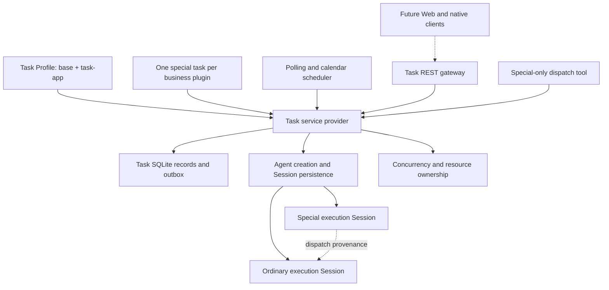
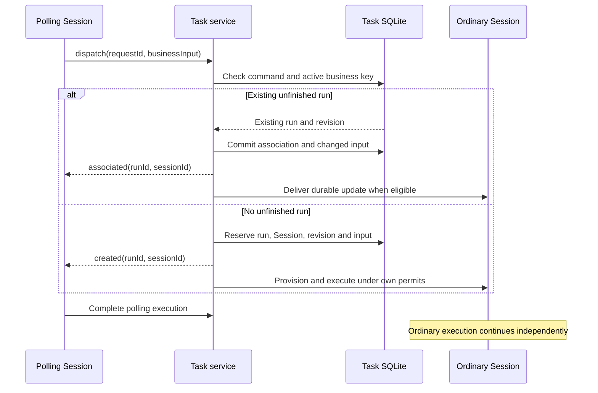

# Agent Note: Task Profile 与可恢复业务执行详细设计

Status: proposed

[English](2026-09-09-task-profile.md) | 中文

## 问题

个人自动化需要发现指派给自己的缺陷和需求、准备周期性汇报，以及执行手动发起的工作，同时让本机 DSH 服务在没有打开浏览器时持续可用。这些操作需要跨多轮会话和进程重启组合模型分析、工具、人工决策与外部写入。重复发现同一业务对象时，必须关联已有未结束工作，避免出现多个并行处理者。

Session 保存会话历史，但不定义业务完成。会话内提醒需要活跃的所属 agent（智能体）；运行时 subagent 依赖父级归属；现有 Workflow 执行不保存业务阶段检查点。可复用的任务系统需要明确调度、执行标识、完成、恢复与插件归属，同时避免将具体业务系统写入 DSH。

## 已确认的独立 Task 应用设计

当前交付和验收覆盖 Task 后端：`base + task-app`、未经修改的 Host WebServer 与 Credentials、Task 专属运行时提供方，以及 3081 端口的 `/api/task/v1`。业务插件、Task Web UI 和原生客户端应用延后实施。下文 UI 描述属于未来要求，不纳入当前验收。未来 Task Web UI 必须独立于 Cordis 客户端插件，通过共用网关接入；业务插件不得携带前端组件。原 Base、Web App 和共享提供方源码保持不变。

公共 Gateway 负责 `/api/task/v1`、REST JSON 操作、两条可恢复 SSE、从运行时 Zod Schema 生成的 OpenAPI 3.1、RFC 9457 错误、分页和稳定 DTO。命令携带幂等键和乐观版本。持久化回执跨重启保留；相同键下内容不同会冲突。取消以 202 确认接收并异步完成。Fetch 客户端不依赖 Cordis。API 时间使用 UTC RFC 3339；现有内部时间戳存储无需改变。内部 checkpoint 和操作回执不成为公共 Run 字段。向前兼容的客户端忽略未知响应字段，Gateway 严格校验自身输出的 DTO。

Task 与 Session 事件流使用不同的持久化游标。先订阅后获取基线，避免丢失更新。队列按字节和数量限制；慢消费者重连并从持久记录补齐。重新同步通知尽力发送：已饱和的连接不能保证再接收一帧。最终模型消息持久化；临时 Token 不承诺持久化。Session、交互和工具内容采用确定性投影，不引入第二份会话存储。

浏览器启动 Token 单次使用、60 秒有效，交换成 30 天有效的签名 HttpOnly Cookie。Cookie 写入需验证 CSRF 和 Host/Origin。设备 Bearer Token 可撤销并只保存摘要；原生客户端将原值保存在操作系统凭据存储。默认监听本机，不允许跨域浏览器访问。共享凭据使用引用、只写变更接口和无原值状态。日志及诊断 DTO 不包含原始 Body、Cookie、Authorization 或解析后的凭据。Session 和备份中的业务内容仍属于私有用户数据；Schema 校验无法证明任意文本不含秘密。

业务插件注册一个稳定定义 ID，仅提供业务及配置逻辑。自包含 Draft 2020-12 Schema、有界内置控件提示、本地化文本、可选配置检查和动态选项源驱动统一表单。不允许远程 Schema 引用、脚本、自定义组件或插件 HTTP 路由。Gateway 负责发现 Task Preset、权限和模型目录。保存配置校验 revision 和 Schema 版本，仅影响未来 Run 并重算调度。已有 Run 保留原配置和 Schema 快照；每次外部操作按引用解析当前凭据。确定性配置迁移控制新任务准入，Run 恢复要求声明代码与 checkpoint 兼容性。

退役事务关闭准入、中止阶段并等待所拥有操作停止后执行 cleanup。cleanup 成功前保留旧包。失败时退役阻塞，资源锁仍保留；超时不能证明异步操作已停止。cleanup 不能与仍拥有资源的操作并行。达到静止状态后才删除包；升级仅在旧版本退役后注册新版本。重启使用保留代码恢复清理。正常 Host 关闭保留可执行 Run 和业务资源供恢复，不对所有任务应用插件卸载式取消。

业务等待、工具审批和 Agent 提问共用公共交互投影，包含来源、标识、revision、Schema 和可选截止时间。第一个有效回复生效，后续过期回复冲突。到期只投递一次持久化 timeout 输入，由插件解释。展示待审批状态不能覆盖引擎阶段状态，也不能阻止等待中的阶段恢复。承诺跨重启回复前，必须从持久状态重建待审批记录。权限策略保持权威。终态 Session 只读，取消后拒绝新输入。

未来共用 UI 单独定义范围，通过公共 API 提供配置、执行历史、Session 交互和附件操作。当前后端交付不包含前端代码或浏览器验收。

附件采用认证的 multipart 上传及有作用域的不透明 ID，按摘要存储在 `tasks/attachments`，明确 Run/Session 所有权、上传限制及 Range 下载。未引用上传暂存与已完成的不可变文件有不同生命周期。通知通过持久标识去重，提供日志 Provider 和后续 Provider 接口；外部业务集成不在本仓库范围内。

启动先获得进程租约、迁移单调版本数据库、恢复 Session、等待初始 Loader 插件树、核对插件兼容性，再启用调度。业务目录为空是合法状态。Live 和 Ready 探针只暴露最小状态。Ready 依赖恢复成功且调度器可用。核心事件日志关联请求、定义、Run、Session 和操作标识，不记录原始业务载荷。进程管理器收集 stderr 并轮转日志。

默认值均可配置：四个并发阶段、一秒调度 Tick、30 秒取消宽限、两分钟 cleanup 和停机期限、30 秒 JSON 请求超时、60 秒配置检查超时、15 秒 SSE 心跳、每条 SSE 队列 512 个事件或 2 MiB、默认每页 50 条且最大 200 条、1 MiB JSON Body、50 MiB 单文件及 200 MiB 单次上传。优先级老化每等待一分钟增加一，最多增加 100；资源阻塞任务不占执行槽。同优先级采用 FIFO。

维护通过现有 `dsh --profile task` 启动器进行备份、恢复和 Token 管理。Task 宿主停止后，备份取得其排他所有者锁，通过 SQLite 备份机制复制数据库，并固定 Session 代际及字节前缀、不可变附件和 Preset 文件。完整清单包含摘要及版本；部分输出不能被视为完成。恢复后核对外部操作，文件备份不代表外部操作被回滚。凭据不进入备份。恢复要求 Host 停止且目标为空，发布前校验完整清单，不覆盖已有用户数据。提供操作系统服务示例但不自动安装。

仅原默认 Task Profile 组合迁移到 `base + task-app`；自定义组合及用户 Patch 仍由用户管理。SQLite 迁移保留 Task 数据且不重写 Session JSONL。后端完成要求行为测试、协议产物、录制模型输出、源码与构建产物 Profile 测试、迁移恢复 Fixture 及受保护源码检查。Task Web UI 和客户端应用验收延后。

命令受理复用 Task 数据库事务，不使用独立的网关回执数据库。保存点组合现有状态变更，已回滚操作不发布审计事件或取消信号。回执保存原始响应快照，JSON 内容比较不受对象字段顺序影响。重试键按认证主体隔离，避免不同调用者相互冲突；配置和启停共用任务定义乐观版本。这些机制确定引擎受理语义；HTTP 认证与 DTO 投影由网关负责；前端集成延后。

Task Profile 在共享 WebServer 上挂载 `task-api-gateway`，不修改该提供者。Credentials 保存版本化 Task 授权记录，包括一次性登录凭据摘要、签名浏览器会话和可撤销设备凭据摘要。HTTP 命令与本地调用者共用原子 Task 受理机制；消费者投影公开字段，并拒绝不符合 Host、Origin、CSRF 和请求大小要求的请求。未声明 Schema 的定义使用 Schema 版本零。此 Profile 不挂载 UI。

Task SSE 复用现有持久化日志，不创建第二份通知存储。SQLite 限制每批重放数量，ready 游标使订阅先于 REST 快照读取建立。客户端保存已交付游标，并在重连后补读。单连接字节上限、发送期限和连接准入限制网关内存占用。后续重放批次之前会检查凭据撤销状态。该订阅承载 Task 通知；Session 流使用独立端点和游标。

Task 会话内容采用有界异步持久化读取，不复用共享历史控制器。该控制器会准备冷 Session，与终态执行的 Task 写入保护冲突。只读句柄保留该保护，也避免新增已弃用的同步事件读取。续读游标校验前一存储记录，拒绝不可用历史，仅暴露原始追加的会话内容。持久化提供者负责缓冲，内部仍可能加载完整日志；网关不引入第二份会话存储。真实 Task Profile 测试验证终态读取不改变执行状态。

## 提案

新增 Task Profile，由 Base 与任务应用组合包组成。每个业务插件恰好注册一个可执行的特殊任务：轮询、日历定时或手动。只有特殊任务执行能够派发普通任务执行；每个普通任务继承派发者的 preset，并在独立 Session 中执行。业务插件定义阶段与结束规则；Task 服务负责持久化准入、调度、执行管理和观察。

以下设计记录业务插件与未来客户端的要求。已交付行为以 [Task 应用决策](../../implemented/architecture/2026-09-13-task-independent-application.zh.md)和各包参考为准；下文设计语句不能覆盖它们。实现入口是通过现有 `dsh` 启动器选择名为 `task` 的 profile；不新增包级可执行入口。

### 范围与目标

首期部署面向单用户、单个持续运行的本机 Host。关闭浏览器不停止工作。操作系统服务管理器可以重启 Host；机器休眠或关机期间不能执行任务，因此唤醒与启动时需要核对错过的触发。分布式执行器、多用户授权、模型自动安装业务代码，以及 Task 页面的具体布局不在本文范围内。

DSH 负责通用服务、调度器、持久化、扩展 API 与 profile。独立的个人业务仓库负责禅道、Meegle、汇报、绩效插件及可复用的 Gerrit 工具。现有脚本可以执行外部操作，但业务插件负责持久化阶段控制。本次文档变更不执行任何实际业务操作。

### 目录

- [架构与现有组件](#architecture)
- [领域模型与不变量](#domain)
- [插件 API 与阶段执行](#plugins)
- [存储与 Session 一致性](#storage)
- [派发、更新与恢复](#execution)
- [调度与资源控制](#scheduling)
- [配置、生命周期与清理](#lifecycle)
- [Web 集成与业务迁移](#integration)
- [后续集成](#implementation)
- [验收标准](#acceptance)

## 架构与现有组件

Task 服务是任务执行的唯一准入方。定时器、Web 操作和模型工具调用该服务，而不是直接创建 agent。业务归属属于注册插件，派发关系则记录执行之间的来源。

### 拟议包职责

包划分遵循可以独立演进的角色。调度算法、SQLite 事务、资源准入及 Session 适配器初期作为本地提供方内部模块，不分别新增公共服务。

| 拟议包与位置 | 职责 |
| --- | --- |
| `@deepseek-ai/dsh-task`，`packages/task/task` | Cordis `TaskService` Service Definition、`ctx.tasks`、品牌标识、注册与执行类型、错误码及浏览器可用的数据导出。 |
| `@deepseek-ai/dsh-task-local`，`packages/task/task-local` | Service Provider：注册表、SQLite 存储、调度器、阶段驱动器、Session 适配器、资源、恢复及所属运行时不变量。 |
| `@deepseek-ai/dsh-task-api-gateway`, `packages/task/task-api-gateway` | 消费者：认证 REST 操作与可恢复 SSE，校验请求并路由 Task 所属 Session 变更。 |
| `@deepseek-ai/dsh-tool-task-dispatch`，`packages/task/tool-task-dispatch` | 消费方：利用特殊任务执行权限向模型提供派发与关联能力，Host 展示转换保持纯函数。 |
| Task Web UI / native applications | 未来共用 Web UI 与原生应用使用网关；后端不包含客户端插件包。 |
| `@deepseek-ai/dsh-task-app`, `packages/bundle/task-app` | 在 Base 上组合 Task 服务与 API 网关的有序补丁层，负责 Task 专属启动与关闭集成。 |

业务插件消费 `ctx.tasks`，注册自己的特殊任务；需要派发时，同时实现特殊执行和普通执行处理器。多个插件可以复用库或 Gerrit 工具包，但一个业务注册不能暴露多个特殊任务定义。一个分发组合包可以安装多个分别拥有生命周期的插件。

### 现有复用与必要补充

| 现有归属组件 | 复用内容 | 必要补充或限制 |
| --- | --- | --- |
| [Profile 加载器](../../../../packages/boot/app-boot/src/profile.ts)与 [Web 组合包](../../../../packages/bundle/web-app/README.zh.md) | 命名 profile、有序补丁、Host/Client 组合。 | 增加 Task 模板与组合包依赖。实时重载必须区分配置更新、服务关闭和业务移除。 |
| [Agent 注册表](../../../../packages/core/agent/src/index.ts) | 调用方持有的创建/恢复句柄及发布前 setup。 | Task 在业务归属范围内保留句柄；通用 Session 激活必须查询任务归属。 |
| [Agent presets](../../../../packages/preset/agent-presets/README.zh.md) | `composeFrom()` 继承同一活跃组合版本。 | 排队子任务及重启需要持久化版本选择；现有 preset ID 和文件时间标记不提供该保证。 |
| [Session 收件箱](../../../../packages/core/agent-loop/src/inbox.ts) | 带标识的消息及持久化收件箱变更。 | Task 投递按稳定 ID 核对持久化回执、准入与取消；仅调用 `followup()` 不构成确认协议。 |
| [Schedule](../../../../packages/schedule/schedule/README.zh.md) | 时钟处理与定时器清理的参考。 | 它面向活跃会话与固定间隔；Task 需要服务所属触发器和新 Session。 |
| [Workflow](../../../../packages/workflow/workflow/README.zh.md) 与 [Jobs](../../../../packages/jobs/jobs/README.zh.md) | 可以在阶段内部使用，并遵守各自生命周期。 | 两者都不是持久化的外层 Task 管理器。 |
| [用户审批](../../../../packages/interaction/user-approval/README.zh.md) | 现有交互展示与审计惯例。 | Host 重启需要持久化业务等待并重建交互，不能依赖保留活跃 Promise。 |
| [领域存储](../../../../packages/storage/storage-domain/README.zh.md) | JSON 校验与持久性惯例。 | 现有 KV 操作没有多记录事务或二级索引；Task 需要事务准入和活跃业务键约束。 |

[Task Surface 提案](../feature/2026-08-04-task-surface.zh.md)讨论的是 Session 内的临时交互。[会话内提醒](../../implemented/feature/2026-08-05-durable-web-schedule.zh.md)、[动态 Workflow](../../implemented/feature/2026-07-05-dynamic-workflows.zh.md)及 [Agent Teams](../../implemented/feature/2026-08-05-agent-teams.zh.md)继续保有各自独立的职责和用途。本提案不取代这些记录，也不意味着它们延期的能力已经可用。

## 领域模型与不变量

任务定义是注册代码与配置。触发实例是执行该定义的一次请求。任务执行是一次获准运行的工作，恰好保留一个 Session 标识。阶段是插件定义的业务阶段；轮次是该执行内的一次模型交互。这些标识不能互相替代。

| 实体 | 标识与必要信息 |
| --- | --- |
| `TaskDefinition` | 稳定的插件所属 `definitionId`；特殊任务类别；可用状态；当前配置、调度与代码版本。 |
| `TriggerOccurrence` | `occurrenceId`、定义、原因、调度版本、计划时刻或手动请求 ID、准入决定及可选执行 ID。跳过的触发没有执行或 Session。 |
| `TaskRun` | `runId`、唯一 `sessionId`、定义、特殊/普通类别、普通任务的最初父执行、业务键、版本快照、状态、阶段检查点、时间与结果。 |
| `RunAssociation` | 不可变的来源执行、目标执行、派发请求 ID、发现时间及观察到的业务版本；后续发现不替换最初父执行。 |
| `RunInput` | 稳定输入 ID、来源、观察到的业务版本、数据、投递状态，以及模型可见时的 Session 消息标识。 |
| `PhaseCheckpoint` | 插件 schema 版本、阶段 ID、尝试次数、JSON 状态、操作意图/结果、待处理交互及预期执行版本。 |
| `ExecutionRevision` | 不可变的已解析业务配置、插件包标识/版本、preset manifest（元数据清单）与内容摘要，以及凭据引用。 |
| `ResourceRecord` | 所属执行或共享归属、类别、安全定位信息、获取标识、清理策略及清理进度。 |

不透明 ID 使用现有品牌库中的 `Branded<B>`。插件提供业务键，例如缺陷 ID 或需求 ID；系统将其限定在稳定任务定义范围内。插件访问多个外部系统时，必须在键中包含必要的实例区分信息。修改键算法需要显式迁移或先结束已有执行。

### 必须保持的不变量

1. 一次注册拥有一个特殊任务定义；普通执行始终指向同一定义中已有的来源特殊执行。
2. 部分唯一约束保证每个 `(definitionId, businessKey)` 最多有一个非终态普通执行，包括准备、排队、阻塞、重试、取消中和恢复中。
3. 执行不更换 Session ID。Session 创建失败时保留预留 ID，重试准备流程，不重新分配标识。
4. 普通执行继承来源执行版本与 preset；不获得派发权限，不能继续创建 Task 执行。
5. 父执行完成或取消不取消普通执行。移除所属业务插件会取消其全部特殊和普通执行。
6. 业务完成必须显式声明。Agent 空闲、收件箱为空、最终回复及工具成功本身均不足以判定完成。
7. 终态执行不能接受业务输入或重新进入活跃状态。后续发现可以创建具有新 Session 的另一执行。
8. 每项模型可见的业务输入和阶段指令均可由 Session 事件重建；仅存在于 SQLite 的上下文不能静默进入请求。
9. 一个任务数据库最多由一个 Host 持有，一个执行最多由一个驱动器持有。旧回调不能修改更新后的执行版本或注册代次。
10. 已完成的清理记录不能同时声称仍有活跃所属进程，也不能将删除失败的资源记为删除成功。

### 执行状态

业务阶段与调度状态分别存储。插件选择业务阶段，但不自行创造调度状态；提供方利用预期版本校验每次状态转换。

| 状态 | 含义与退出条件 |
| --- | --- |
| `provisioning` | 已预留执行和 Session ID；创建或核对 Session 后才准许执行工作。 |
| `queued` | 就绪输入或下一阶段等待执行名额与资源。 |
| `running` | 一个阶段激活持有执行名额与取消信号。 |
| `waiting_input` | 持久化的业务问题或确认等待版本匹配的回复。 |
| `waiting_retry` | 可恢复错误具有插件选择的重试时刻与次数限制。 |
| `blocked` | 凭据、缺失依赖、外部结果不确定或其他明确条件需要解决。 |
| `recovering` | 启动时核对持久化状态、Session 投递、资源与插件检查点，然后恢复。 |
| `cancelling` | 已关闭准入；所属操作正在停止，并执行取消清理。 |
| `succeeded`、`failed`、`cancelled` | 不可变结果。`failed` 表示插件的最终失败规则或明确不可恢复的运行时失败，而不是临时异常。 |

每次转换记录原因与时间。清理具有独立的 `pending/running/blocked/complete` 状态：业务成功可以与产物清理失败同时存在。只要仍可能发生执行副作用，就继续占用活跃业务键；进入终态必须等待运行时完全停稳，之后清理墓碑仍可保留资源预留。处理同一业务对象的新执行必须等待任何冲突的保留资源。

## 插件 API 与阶段执行

服务提供类型化注册 API，不接受通过 Web 传入的可执行工作流文档。安装的业务代码是可信 Cordis 代码。配置和业务载荷始终作为经过校验的数据；模型不能注册代码、修改自身任务类别、选择其他插件归属，或在派发时指定任意 preset。

### 注册与控制操作

以下签名描述拟议操作，不是可编译声明。公共实现类型必须区分 Host 专属句柄与协议数据，并记录参数、结果、dispose（资源释放）及错误结果。

| 操作 | 调用方与语义 |
| --- | --- |
| `register(owner, definition) -> disposer` | 业务插件；`owner` 是其准确的 Cordis Context，每个插件实例恰好贡献一个稳定定义。注册在打开准入前校验配置、处理器、preset、schema、资源与调度。释放函数同步关闭准入，并返回需要等待完成的异步清理。 |
| `updateConfig(id, expectedRevision, patch)` | 配置控制器；校验并记录新版本，不修改在途执行的快照。 |
| `setEnabled(id, enabled, expectedRevision)` | 停止或恢复未来触发；仅禁用不会停止已接纳执行。 |
| `triggerManual(id, requestId, input)` | 面向用户的控制器，用于手动任务定义；请求 ID 使传输重试具备幂等性。输入按插件 schema 校验。 |
| `dispatch(authority, requestId, businessInput)` | 活跃特殊执行的代码或工具；计算插件业务键，并原子地关联或创建普通任务。返回 `created` 或 `associated`、目标执行/Session ID 及已接纳输入版本。 |
| `respond(runId, waitId, expectedRevision, response)` | 面向用户的控制器；校验待处理交互，持久化回复后才确认接收。 |
| `sendInput(runId, requestId, input)` | 面向用户的控制器；为未结束执行排入业务输入，不绕过阶段校验。 |
| `cancel(runId, requestId)` | 面向用户的控制器或插件；关闭执行准入、持久化意图并开始取消。接纳取消与清理完成是不同结果。 |
| `listDefinitions`、`listRuns`、`getRun`、`observe` | 只读消费方；提供游标分页、过滤、带版本快照及已提交游标之后的变更。 |

注册内容包括 `kind`、输入/检查点/结果 schema、preset 声明、`runSpecial`、可选 `runOrdinary`、`businessKey`、`compareUpdate`、`resume`、`classifyError`、`priority`、`resources` 和 `cleanup`。仅声明相应能力时要求对应钩子：需要派发的插件必须提供普通执行处理器与键函数；读取持久化数据的插件必须解码其检查点版本。这些是同一次注册的扩展方法，不是可单独配置的普通任务定义。

所有注册都使用 `ctx.effect()` 并返回释放函数。稳定标识跨禁用/启用及进程重启保留；代码卸载时激活代次改变。重复定义明确失败，不能以后写覆盖先写的方式替换注册。

### 持久化阶段协议

阶段激活接收不可变的执行/配置快照、持久化检查点、有序输入批次、取消信号及运行时持有的能力。它返回一个持久化决定：进入指定阶段、等待输入、等待重试时刻、按原因阻塞、携带结果成功，或按最终错误失败。长期人工等待不保留 JavaScript 调用栈。

提供方利用 `expectedRevision` 将已消费输入 ID、下一检查点、状态及待执行命令一起提交。来自旧激活的重复完成被拒绝。插件检查点 JSON 有独立 schema 版本；未知版本以明确兼容性错误阻止恢复。一个阶段可以执行多个模型轮次，但提供方不能将任意轮次结束视为阶段完成。

拟议的 `run.model(operationId, request, completionRule)` 能力准备并记录阶段输入，通过现有 Agent 接口启动工作，将已接纳消息和已提交输出关联到该操作。它使用持久化输入标识及明确完成证据，例如插件校验的结构化捕获结果或具名业务结果。`whenIdle()` 仅用于完成关联后的完全停稳检查。准入前取消、空输入或被拒绝的 pre-step 都必须能够结算，不能挂起或假装已有结果。

外部动作使用已记录操作 ID，以及 `prepared`、`confirmed` 或 `uncertain` 状态。插件先记录意图再调用脚本，之后保存经过校验的回执，并为不确定结果提供核对逻辑。系统保证任务准入幂等和意图持久化，不承诺外部写入恰好一次。例如 Gerrit 推送响应丢失时，在再次推送前通过 Change-Id 和提交标识核查。

### 业务等待与权限

等待记录包含稳定的 `waitId`、阶段与检查点版本、业务数据版本、预期回复 schema、可读内容及产物引用。提交只能消费该等待一次。新业务信息可以使等待失效，迟到回复返回 `task/wait-stale`；前端不能意外批准已经被替换的方案。

业务确认和工具权限分别处理。插件决定自身流程是否需要确认，但不能静默覆盖 DSH 的执行权限。现有审批与提问 UI 可以展示等待，持久化 Task 适配器负责在 Host 重启后重建交互，并使回复经过任务版本检查。仅浏览器断线不改变业务状态。

继承父 preset 不代表获得派发权限。派发工具仅安装到特殊 Task 角色，服务还独立检查活跃角色、归属、注册代次与执行非终态。普通执行可以使用继承的业务工具，包括 Gerrit，但不能调用其他通用 spawn/workflow/会话创建工具绕过 Task 准入。Task preset 必须禁用这些创建路径，或让它们经过同一角色检查；仅靠提示词不足以约束。

## 存储与 Session 一致性

本地提供方拥有 Task 专属 SQLite 数据库，其本机路径可配置，位于解析后的 Harness home 下。数据库采用短事务与单调递增的 `SCHEMA_VERSION`，事务性迁移并拒绝未来 schema。它独立于 Session JSONL 文件，也独立于现有领域 KV SQLite 物理 schema。它负责原子准入、活跃业务键唯一性及带索引调度，这些能力无法用现有领域 API 表达。

### 持久化记录与索引

| 表 | 必要数据与约束 |
| --- | --- |
| `definitions` | 稳定 ID、注册包标识、期望启用状态、可用状态、配置版本、调度版本及生命周期意图。代码未加载不等同于定义已删除。 |
| `revisions` | 不可变执行版本及插件/检查点 schema 版本；引用文件有不可变内容摘要与受管位置。 |
| `occurrences` | 日历触发唯一键 `(definition_id, schedule_revision, scheduled_at)`；手动请求唯一性与轮询完成标识；决定与执行引用。 |
| `runs` | 执行 ID、唯一 Session ID、定义、类别、最初来源、业务键、检查点、状态、终态时间、归属代次、预期版本、优先级及下次可执行时间。 |
| `associations` | 唯一的来源派发请求与目标；引用双方执行并保留每次发现来源。 |
| `inputs` | 唯一投递/请求 ID、目标、插件业务版本、载荷、消费版本及可选 Session 消息 ID。 |
| `waits` | 唯一等待 ID、目标执行与阶段版本、回复 schema、待处理/已回复/已失效状态及回复回执。 |
| `operations` | 执行内操作 ID、阶段尝试、意图摘要、结果回执及核对状态。 |
| `resources` | 归属、获取标识、互斥键、受管定位信息、清理动作/版本及保留预留。 |
| `journal` | 单调全局变更游标、执行/定义版本、命令 ID 及已提交变更事实。 |
| `session_outbox` | 唯一屏障 ID、目标 Session、执行快照、投递状态及已确认刷新时间。 |

索引覆盖按定义查询非终态执行、到期触发/重试、待处理 outbox、按执行查询输入及日志游标。针对 `terminal_at IS NULL` 的普通执行，在 `(definition_id, business_key)` 上建立部分唯一索引，约束活跃关联。schema 检查要求普通任务具有业务键与来源 ID，并拒绝特殊任务伪装普通任务。唯一派发 ID 保证父命令重放时，即使第一次的目标已经结束，也不会再次创建执行。

`journal`、当前记录与 outbox 意图在同一事务中提交。SQLite 是任务准入、状态和检查点的真源；Session 是模型历史的真源。日志变更仅在持久化后通知观察方。数据库写入失败或结果不确定时不启动模型工作。内存索引与定时器只是可重建视图；Session 日志不是第二个可写任务数据库。

### 执行与 Session 创建协议

1. 在数据库事务中校验定义代次与来源权限，预留执行和 Session ID，提交活跃业务键关联，并排入 Session 准备操作。仅返回已经持久化的准入回执。
2. 通过 Task 替代 Agent 与 Session 提供方准备预留 Session，使用经过校验的 cwd 和指定版本 preset setup，并在激活前刷新 Session 持久化。
3. 在 SQLite 中记录准备成功与待处理初始输入。如果崩溃导致 Session 已存在但 SQLite 未确认，则将 Session 标识与预留执行记录比较，并使用同一标识继续。不匹配时阻塞恢复，提供方不能接管无关 Session。
4. 数据库关联与输入准备持久化后，执行才具备调度资格。Session 创建失败持续作为可见的准备问题。已取消的准备意图不产生模型工作；预留标识与取消历史仍可查询。

执行目录拥有稳定的受管 cwd，与临时 worktree 分离。删除 worktree 或下载附件不能删除 Session 的存储位置，也不能导致历史无法打开。Workspace 成员关系是可恢复、幂等的 UI 关联，不决定 Task 归属。

### Session 屏障与模型输入

Task SQLite 负责任务生命周期、来源关系、执行到 Session 的关联及检查点状态。Session JSONL 只包含共享 Session 接口产生的普通会话事件。此分工保持已发布的 Session 事件类型不变，也避免 Task 状态出现第二份可写副本。

适配器按 Session 串行处理 `session_outbox` 屏障。屏障携带要求 Session 已持久化的执行快照。适配器先刷新 Session，再记录屏障确认。崩溃后重复刷新是安全的，包括 JSONL 已持久化但 SQLite 尚未确认的情况。

模型输入由稳定投递 ID 派生消息 ID。适配器将带标识输入入队而不唤醒执行，刷新收件箱回执，再调用 Task Agent Loop 的唤醒操作。恢复需要检查收件箱插入、消费、已提交用户消息及取消记录；仅当前收件箱中不存在不能证明从未投递。输入已消费但业务结果未结算时，恢复该操作的核对规则，不能盲目重新入队。模型通过已记录消息读取接纳内容，不能在提示词渲染时查询可变插件状态。

终态结算先阻止新活动并等待完全停稳，再提交数据库结果与最终 Session 持久化屏障。Task 控制器立即根据数据库结果执行只读限制。Task Profile 替代提供方在受支持的修改路径前查询数据库关联；执行进入终态或业务插件不可用时，可读历史仍可查看。

SQLite 与 JSONL 不共享事务。恢复按不可变标识显式核对准备、输入投递、完成轮次及屏障。Task 存储停止后，备份/导出必须同时包含 SQLite、JSONL 及引用的版本/产物文件；仅恢复一种存储不能宣称完成任务恢复。

## 派发、更新与恢复

插件提供业务含义，提供方串行化变更并保留其标识。已完成的来源 Session 保留来源记录，但不是普通任务的活跃资源持有者。

### 发现与关联

`businessKey` 和 `compareUpdate` 基于经过校验的快照工作，不能在准入事务内执行网络 I/O。提供方先计算候选变更，在事务中检查目标预期版本；其他更新已提交时重新计算。即使没有有效业务变化，也持久化命令回执与关联。不变的关联不会唤醒模型。

变化输入在来源收到确认前完成持久化。插件决定追加分析上下文、使确认失效、中断阶段，或取消目标。更新遵循目标串行输入顺序。外部系统提供版本时，插件比较版本并拒绝陈旧信息；运行时不根据 HTTP 返回先后推断业务顺序。

执行进入终态时到达的更新，由同一活跃键事务裁定：它要么属于仍活跃的执行，要么在终态结算后创建后继执行。相同派发请求重放时返回原回执，包括已经结束的目标；只有后续不同派发才能创建后继。取消一个普通执行不会建立忽略规则，因此插件仍选择该条目时，后续轮询可以创建另一执行。

### 继承能力与运行时父级归属分离

提供方在业务注册的所属作用域下，将特殊和普通 agent 创建为 Task 管理的运行时根节点。不能仅为表达派发而设置 `parentAgent` 或 `origin: subagent`。Task 记录保存来源关系；不能将 Session `parentSession` 当作未定义的任务关系或 fork 前缀。

立即创建且来源仍活跃时，preset 适配器可以使用 `composeFrom()`。延迟启动、恢复或来源已经完成时，则使用不可变执行版本。两条路径必须解析为相同的工具/提示词组合。普通执行拥有独立 Session，能够接收人工问题，不依赖已释放的父 agent。

Task 提供方持有创建/恢复句柄，在每个阶段和模型步骤前检查角色准入。来源结果不能释放其子执行句柄或版本引用。业务插件移除先关闭注册代次，再清理所属全部执行，包括来源早已完成的普通执行。

### Host 启动与恢复

1. 为规范化后的 Task 存储标识获取进程生命周期独占锁。第二个使用同一存储的 Host 必须在激活业务代码或发送模型请求前失败，不能仅凭心跳过期抢占归属。
2. 打开并迁移数据库、校验持久化数据、建立新 Host 代次。加载已配置业务注册但不启动触发器；未知插件、缺失版本或无效检查点作为可见的可用性/恢复错误。
3. 优先核对待处理生命周期操作。已明确记录的移除继续取消和清理；普通 Host 关闭保留未结束执行。包意外缺失时阻塞所属执行，不静默删除或标记完成。
4. 根据实际受管进程、worktree 与浏览器归属核对资源记录。外部资源确认停止或安全之前不释放旧锁，不能仅凭 PID 识别进程。
5. 核对执行到 Session 的关联、Session 屏障、已消费输入、等待与外部操作回执。使用保存的阶段和执行版本调用对应插件的 `resume` 钩子。
6. 重建队列和待处理交互，然后启用触发调度。轮询恢复先完成已有未结束巡检，再启动替代巡检；普通执行不阻止其轮询来源继续调度。

正常服务关闭会关闭准入、保存检查点、中止活跃操作、刷新存储并释放临时运行时资源，但不把执行标为取消，也不删除用于恢复的 worktree。崩溃可能留下部分执行脚本或结果不确定的外部动作，由插件核对。认证过期阻塞相关阶段并保留 Session；重新认证成功后重新排入原执行。

未预期的插件异常记录为恢复/阻塞错误，除非插件错误分类器明确选择重试或最终失败。重试具有持久化次数与到期时刻，因此重启不会重置预算。重试延迟、抖动、最大次数、活跃操作超时与人工等待有效期均属于经过校验的配置或插件策略。默认不会无限重试，也不会把时间流逝当成人工批准。

## 调度与资源控制

持久化触发实例表示时间或手动命令请求了工作，不代表工作已经开始或成功。调度器先记录意图再排队，并从持久化可执行条件派生实时定时器，不能用定时器代替存储。

### 轮询

轮询定义具有可配置的正数 `intervalMs`；首次启用立即接纳一次巡检。巡检进入终态时，原子记录 `finishedAt` 与 `nextDueAt = finishedAt + intervalMs`。等待、阻塞、恢复或重试中的巡检仍是同一次执行，并阻止另一巡检。所有选中条目都取得持久化派发回执后，巡检即可完成，无需等待普通任务结果。批次中已完成的派发保存检查点，重试使用相同的逐项请求 ID。

Host 唤醒时，如果没有未结束巡检且 `nextDueAt` 已到期，只接纳一次巡检，不重放所有错过的间隔。新的完成时间建立下一次延迟。在活跃进程内，单调时钟等待保证剩余间隔；持久化墙上时钟目标用于重启。时钟变化触发重新计算，不能为同一次完成创建第二个触发实例。轮询永久失败结束该执行；除非插件明确禁用或阻塞后续触发，定义仍继续调度。

### 日历定时

日历配置保存经过校验的五字段 cron 表达式、明确的 IANA 时区、调度版本、生效时间及补跑/重叠策略。初始时区可配置，Task Profile 默认为 `Asia/Shanghai`。日历计算使用在实施时选择并验证的维护中依赖；本提案不指定未经验证的包，也不手写 cron 解析器。

保存每个已接纳的计划 UTC 时刻及其本地日历标识和调度版本。夏令时导致重复的本地时间选择较早时刻；不存在的本地时间跳过并记录。时钟回拨不能重新接纳已记录触发。调度变更从记录的生效时间起应用；已经接纳的触发保留原调度和执行版本。启动时检测时区数据版本变化，并在计算尚未生成的新触发之前记录。

| 策略 | 语义 |
| --- | --- |
| `catchUp: all` | 按时间顺序分批生成配置范围内错过的触发，并为每个选中项排入执行。 |
| `catchUp: coalesce` | 保留错过的触发范围，创建一次执行并在输入中携带该范围；由插件处理对应业务周期。 |
| `catchUp: skip` | 记录跳过的范围，并安排下一个未来触发。 |
| `overlap: queue` | 默认行为：已有未结束特殊执行时，后续触发保持排队，包括等待人工输入期间。 |
| `overlap: allow` | 在全局/插件/资源限制内允许重叠；插件负责业务周期语义。 |

补跑范围、扫描批次大小及待处理触发上限均为配置，不是隐藏常量。补跑范围外的工作明确记录为跳过区间。达到待处理上限时，在持久化游标处停止继续生成并报告积压压力，不能将游标推进到尚未记录的工作之后。插件必须声明补跑选择；运行时不能假定所有汇报提交都可安全重放。

节假日和业务日历检查属于业务插件。业务跳过记录原因与受影响触发，不能声称汇报已经提交。周报与报工即使读取相同历史数据，也可以采用不同策略。

### 手动触发

前端选择已注册的手动定义并提供类型化输入。相同请求 ID 返回同一触发与执行；新请求 ID 是新触发。特殊执行的派发逻辑仍可关联已有未结束的同业务普通任务。手动操作不允许直接创建普通执行，也不将轮询定义转换为手动定义。

### 准入与资源

提供方执行可配置的全局和插件级正数执行上限。每个活跃特殊或普通阶段均占用名额，因此巡检本身不能绕过全局限制。等待阶段持久化检查点并释放执行名额；恢复、工具续接和后续模型步骤重新获取名额。调低上限阻止新准入，不终止已接纳工作。

插件返回有限数值的优先级；调度器按该值及入队时间排列具备资格的工作。默认不抢占在途工作。可配置调度策略可以增加等待老化以避免饥饿，但不能覆盖资源互斥。优先级变化影响排队工作并被记录。

资源使用明确的稳定键与声明容量，例如共享编译名额、规范化仓库操作或浏览器用户数据目录。提供方按规范顺序原子授予一次激活所需的完整资源集合，避免执行持有部分资源等待剩余部分。插件必须在受保护动作前声明请求；脚本未声明的直接访问不在调度器保证范围内。

区分临时激活资源与保留的执行资源。等待批准时释放 CPU/模型/编译名额，但私有 worktree 仍归属原执行。浏览器仍活跃时，其用户目录继续加锁，直到浏览器退出。获取长期执行资源时，进入长时间等待前需要释放临时名额；驱动器不能在等待资源时占满全部执行名额并造成死锁。

隔离必须落实到实际操作。代码任务使用独立 worktree；共享检出目录修改、worktree 注册维护、Git 元数据变更、需要互斥的编译缓存及共享浏览器状态使用相应资源键。清理和崩溃恢复使用同一组键，因此前驱仍持有冲突资源时，后继不能开始。

## 配置、生命周期与清理

定义配置、执行配置和安装代码具有不同生命周期。Task 控制器通过带版本操作修改数据；仅依赖普通 Cordis 清理不能区分用户卸载与正常 Host 关闭。

### 配置版本与 preset 生命周期

已解析执行版本保存插件代码标识、业务配置、模型/工具选择、生效的 preset 组合、提示词/skill（技能）资产摘要及 schema 版本。配置求值后记录已解析 JSON 数据；重建历史配置时不重新执行原始 `!!js` 表达式。秘密保留为凭据提供方引用，不进入快照字段或复制的环境文件。

准入前，将 preset 文件与引用的非秘密提示词/skill 资产复制到受管的不可变版本位置。包代码引用按包版本与完整性固定。任意可变文件属于运行时输入，不会隐式成为冻结的可执行资产；插件必须区分两者。恢复校验所需资产与已安装代码，不能静默回退到当前 preset 或默认模型。

preset 适配器需要具有引用计数的显式版本句柄。来源以及每个排队或活跃普通执行分别保留版本引用。最后一个运行时引用释放后，dispose 对应常驻组合；只要执行或保留历史引用它，持久化快照仍然保留。现有 preset 挂载生命周期需要扩展，因为旧活跃版本目前不会按加入者数量回收。

配置更新先校验，再发布新版本。触发间隔与执行上限改变后续准入；业务指令和工具配置仅影响新执行。关联到已有执行的输入按该执行版本解码和解释。最新业务数据不能静默更换已有执行的工具。

### 禁用、移除、升级与关闭

| 操作 | 未来触发 | 已有执行 | 持久化数据 |
| --- | --- | --- | --- |
| 禁用定义 | 停止；保留调度游标，之后按策略记录错过周期。 | 继续执行。 | 保留配置、历史与检查点。 |
| 更新配置 | 从生效时间起使用新调度版本。 | 保留已保存业务/preset 版本。 | 追加不可变版本。 |
| 移除业务插件 | 立即关闭准入并记录移除意图。 | 取消全部所属特殊/普通执行，并清理资源。 | 保留历史与恢复产物；注销注册。 |
| 升级业务代码 | 关闭旧准入；完成移除清理后加载替代版本。 | 取消旧执行，不隐式交给新代码。 | 保留旧结果；新触发使用新代码标识。 |
| 停止或重启 Host | 暂停调度，并在可能时记录关闭意图。 | 保留未结束工作，用原 Session 恢复。 | 刷新并保留检查点及执行所属产物。 |

Task 启动/关闭集成必须在移除插件 effect 前持久化操作原因。实时补丁重载将纯配置更新与代码移除分别处理。需要替换业务插件时，其所属处理器代次不能在取消和清理完成前消失。包事务必须先清理旧代码持有的工作，再删除其文件；外部直接删除文件会被检测为代码缺失，并阻塞恢复。

生命周期意图包含目标定义/代次、操作 ID、原因和清理进度。即使前一个 Host 在清理中退出，启动也继续已记录的卸载或升级。重新启用或安装稳定定义不复活终态执行；后续发现可以创建后继。未完成清理的墓碑在注销后保留，并且必须可见。

### 清理协议

1. 关闭待移除代次的触发、派发、回复和阶段准入；持久化取消意图并使待处理确认失效。
2. 中止所属模型操作、工具调用、子进程树、worker 执行及浏览器活动。等待实际退出；仅通过受支持的进程/worker 句柄应用可配置宽限时间与强制终止。
3. 利用持久化资源记录执行插件清理。移除 worktree 前，将未提交的已跟踪、暂存及未跟踪代码保存为可恢复产物，并校验产物存在且可读取。保存失败则保留 worktree，并报告清理阻塞。
4. 仅移除已登记临时文件和所属 worktree；保留共享仓库、凭据、浏览器登录数据、Session 日志及 Task 历史。资源路径必须校验归属，并安全处理符号链接。
5. 持久化逐项清理结果、释放已确认资源、dispose preset/注册资源，并在运行时完全停稳后结算取消。失败清理独立重试，并暴露其阻塞状态。

清理处理器必须幂等且可恢复；提供方同时支持停止所属进程、删除所属临时目录等通用登记动作。依赖缺失代码的业务专属清理持续阻塞，直到代码可用。超时不能成为删除仍被进程使用的目录或释放其资源锁的理由。

可信同进程插件代码如果阻塞 JavaScript 线程，就无法被强制中断。因此业务钩子只执行有界控制工作，耗时或需要取消的外部操作通过受管子进程/worker 执行。系统可以立即请求取消，但完成必须表示观察到完全停稳，而不只是发出 abort 信号。

## Web 集成与业务迁移

Task Profile 复用 Host WebServer 提供 API 网关。未来 Task Web UI 和原生应用独立使用该网关。业务插件不提供前端组件；当前验收覆盖后端能力与观察语义。

### API 与 Session 归属

Task API 提供定义配置/可用性、分页执行历史、任务详情与关联、待处理交互、取消、清理状态及手动触发。不提供创建任意任务定义或安装可执行业务代码的 Web 接口。插件配置 schema 与类型化业务操作支持新增业务插件而无需修改 Task 核心。

通用 Session 操作在创建/恢复、追加输入、steering（中途引导）、模型/preset 修改、清空、fork 或其他能够启动工作及改变执行上下文的操作之前，必须识别任务归属。Task 所属修改操作路由到 Task 控制器；终态返回 `task/terminal-read-only`。只读检查/导出与无关普通 Session 保留各自语义。对终态 Task Session 进行 fork 不能绕过仅特殊任务可创建执行的规则；启动后继工作必须经过已注册特殊任务与新执行。

Task Profile 替换共享 Session、Agent、JSONL 持久化、Agent Loop 与 Agent Preset 提供方条目。替代实现保留共享公开类型，并在受支持的冷态与活态修改路径上查询 Task 数据库关联。Task Profile 还安装 `agent/pre-step` 和 `tools/pre-execute` 检查作为执行保护；waterfall（瀑布式事件）监听器在允许时通过 `next()` 委托。共享 Agent Loop 保持不变；Task 专用副本负责通用 Task 授权与持久输入唤醒，不包含具体业务分支。

前端重连从带版本快照开始，并续接游标后的变更；游标超出保留日志范围时重新获取快照。Task 与 Session 流使用不同游标，通过执行/Session ID 关联，不能猜测时间戳。稳定错误码区分 `task/not-found`、`task/definition-unavailable`、`task/revision-conflict`、`task/wait-stale`、`task/terminal-read-only`、`task/dispatch-forbidden`、`task/resource-blocked`、`task/recovery-blocked` 和 `task/persistence-uncertain`。

Host 派发展示保持纯函数，并区分关联与创建；回执链接已有或新预留 Session，不能声称执行成功。Client 卡片从已提交任务数据与 Session 事件派生，包括清理失败。产品文案属于类型化语言字典；业务插件负责本地化名称、配置标签及交互内容。禁用或损坏插件仍带原因展示，不能连同历史一起消失。

### 业务插件打包

每个特殊任务是个人业务仓库内独立的 Cordis 插件。共享外部系统客户端、凭据解析、脚本执行器及 Gerrit 工具作为可复用包。可安装组合包声明补丁层及解析依赖；裸插件需要挂载配置项，不会仅因包已安装就自动激活。Profile 配置保存非秘密业务设置；凭据来自凭据服务，浏览器登录态保留在单独拥有的目录。

| 特殊业务插件 | 特殊执行 | 普通任务或直接结果 |
| --- | --- | --- |
| 禅道轮询 | 获取并分类选中的全部本人缺陷；按插件定义键为每个选中缺陷派发任务。 | 检查附件、分析、按需等待、实现、编译、通过 Gerrit 发布、更新外部状态并记录工作。 |
| Meegle 需求轮询 | 获取选中的本人需求/任务，包括配置的业务类别；按插件定义工作项键派发。 | 收集需求/UI 上下文、方案、实现、验证、发布、推进本人节点并记录工作。 |
| 周报定时 | 收集配置的汇报周期并准备周报。 | 在特殊 Session 内完成，或按插件需要派发有界普通事项。 |
| 报工定时 | 读取适用汇报周期并准备缺失报工记录。 | 核对已填写/提交周期，再按插件业务规则填写或提交。 |
| 绩效手动 | 接收周期及明确提供的业务输入。 | 起草、请求插件要求的审核，并仅按该插件规则保存或提交。 |

共享 Gerrit 能力校验提交字段、reviewer 解析、仓库/worktree 归属及 Change-Id 处理，随后返回结构化提交/评审回执。它是工具能力，默认不是额外特殊任务。源 skill 中冲突的指令必须整理为唯一插件阶段规则；确认要求既不全局强制，也不全局移除。

### 禅道端到端示例

一次轮询执行使用 Session P 获取缺陷 A、B。两个稳定派发请求创建普通执行 A1、B1，分别使用 Session S1、S2。提供方在 P 完成前记录两条关联和版本继承。A1 进入可选业务等待；B1 在可用资源名额内继续。

下一次巡检 P2 再次发现 A。业务未变化时记录到 A1 的关联，不在 S1 中产生模型请求。新增日志时，插件向 S1 发出带版本更新，使受影响等待失效，并决定重新进入哪个阶段。旧确认不能授权变化后的方案。

Host 重启后，A1 保留 S1 和待处理阶段。如果 B1 已推送代码但丢失响应，其恢复钩子查询外部评审并记录已确认回执，然后再更新禅道。A1 进入终态后，只要 A 仍被选中，后续不同巡检就可以创建具有新 Session 的 A2。移除禅道插件会取消其全部未结束执行并清理登记资源，而汇报插件继续运行。

### 脚本适配要求

脚本调用接收明确 JSON 输入或经过校验的 argv、明确 cwd、限定范围凭据、超时/取消信号及声明资源。返回带版本结构化结果，分别记录业务状态、进程退出/信号/超时事实、产物、外部标识及核对提示。仅 stdout 诊断不能证明外部写入成功，仅 HTTP 错误也不能证明失败。

业务适配器显式处理分页和部分发现，不能只读取第一页就静默把巡检批次标为完成。长下载和编译在支持时保存可恢复进度。浏览器自动化使用受管专属上下文；登录挑战进入持久化阻塞状态，不能无人值守地循环重复提交。脚本依赖与浏览器安装属于插件部署前提，不由模型在业务执行中临时修复。

### 本机服务运行

操作系统服务管理器使用明确的 home 和工作目录调用常规 DSH profile 启动器，记录启动/恢复错误，并重启失败 Host。具体平台服务文件与安装命令属于实施验证内容。Task Profile 保留现有 Web 认证/网络策略，并默认本机使用；无人值守执行不意味着扩大网络暴露范围。

运行观察信息包括调度启用/阻塞状态、下次到期时间、积压、最早排队项、活跃名额、资源持有者、待处理输入数、恢复错误、outbox 延迟及清理失败。结构化日志包含定义/执行/Session/操作 ID，并排除凭据。空巡检 Session 仍计为执行；存储与模型成本随轮询频率增长，因此需要部署配置及磁盘压力报告。

历史和恢复产物默认保留。临时文件遵循插件清理策略。版本回收要求没有未结束执行、没有清理操作且没有保留历史引用；不能删除恢复所需资产。自动破坏性历史保留策略不属于首期实施，且不能修改已提交的 Session 文件代次。

## 后续集成

Task 后端已实现。[Task 应用](../../../../packages/bundle/task-app/README.zh.md)与 [Task 子系统](../../../../docs/subsystems/task.zh.md)说明当前行为。业务集成在执行无人值守的外部写入前，必须使用持久化操作及恢复规则。

| 集成 | 必需行为 |
| --- | --- |
| 业务插件 | 独立禅道插件与从脚本适配的共享 Gerrit 工具；随后加入 Meegle、周报、报工和绩效插件，各自提供明确操作回执与清理。 |
| Task Web UI 与原生应用 | 未来共用客户端通过网关接入，不使用 Cordis 客户端插件，也不提供业务专属前端组件。 |

业务集成可以从确定性或只读适配器开始。UI 布局单独设计；公共网关已经负责后端交互与观察语义。

## 考虑过的替代方案

**长期复用轮询 Session。** 未采用，因为各次触发需要独立历史与执行结果；持久化发现状态属于插件，普通业务工作则保留自己的 Session。

**直接使用运行时 subagent。** 未作为外层任务关系采用，因为来源完成不能销毁普通任务，人工交互也必须独立可达。复用现有 preset 继承，但不赋予运行时父级归属。

**扩展会话内 Schedule 或将 Workflow 视为持久化执行。** 未采用，因为冷会话激活、全局任务标识、日历触发及检查点恢复超出这些组件当前职责。仍可在阶段内使用。

**仅靠提示词编排业务。** 未采用，因为阶段顺序、批准版本、不确定外部写入和重启恢复需要可执行业务规则及持久化证据。

**在 Web 编写任务定义。** 未采用，因为业务能力通过安装插件进入系统；Web 管理其配置和执行，不接受任意可执行定义。

**用现有领域 KV 写入实现活跃查找后创建。** 未采用，因为分离写入不能原子保证跨记录唯一性与持久化派发回执。专属事务提供方明确承担该要求，不声称通用存储已有不支持的事务。

**立即重写全部现有脚本。** 未采用，因为外部操作可以通过经过校验的适配器复用，同时将阶段管理和恢复移入业务插件。

## 验收标准

实现依据可观察行为和故障恢复验收，而不仅是 API 是否存在。全部拟议不变量必须通过仓库顶层检查执行，每条变更后的准入规则都必须具有拒绝案例。

| 场景 | 必要证据 |
| --- | --- |
| 插件扩展 | 安装/挂载独立测试业务插件，修改配置、禁用/启用并移除，无需修改 Task 核心；每个插件恰好注册一个特殊定义。 |
| 任务权限 | 拒绝普通到普通派发、伪造来源归属、任意 preset 选择，以及通过通用工具绕过准入的创建。 |
| 重复发现 | 多个并发巡检请求对同一键仅产生一个未结束执行，并持久化全部关联。重放同一请求即使目标已完成也返回原回执。 |
| 业务更新 | 无变化关联不唤醒模型；变化数据向原 Session 投递一次，陈旧确认被拒绝。 |
| 父级独立性 | 巡检完成与父执行取消不影响普通任务存活；插件移除取消全部所属工作。 |
| Session 标识 | 重试、人工等待和重启保留执行/Session ID；终态 Session 通过全部受支持载体拒绝修改；无关聊天不受影响。 |
| 双存储崩溃恢复 | 在预留、Session 准备、收件箱刷新、输出结算和最终 Session 屏障前后注入故障，证明已确认命令不丢失、模型输入不重复准入。 |
| 外部结果不确定 | 模拟外部成功但响应丢失；恢复核对回执，不盲目重复提交。 |
| 配置 | 在途执行与排队子执行保留来源版本；历史资产缺失时阻塞而不回退；不再使用的活跃 preset 版本被释放。 |
| 轮询时间 | 长时间/阻塞巡检不重叠；间隔从完成起算；启动/唤醒只产生一次过期巡检；时钟变化不重复触发。 |
| 日历时间 | 验证时区、夏令时缺失/重叠、调度编辑、all/coalesce/skip 补跑、queue/allow 重叠、范围决定及积压游标保留。 |
| 并发 | 特殊/普通执行共同遵守全局/插件上限和资源容量；等待工作释放执行名额；清理预留阻止冲突后继。 |
| 生命周期 | Host 重启恢复、插件移除取消、中断升级继续清理。释放锁前观察真实所属子进程/浏览器退出。 |
| 产物安全 | 移除 worktree 前保留未提交代码；保存失败留下可恢复数据；共享仓库/登录态及 Session 历史保留。 |
| 观察 | 快照加游标重连完整；陈旧游标重新获取；持久化错误不表现为成功；业务成功后清理失败仍可见。 |

纯状态/调度测试使用注入时钟与确定性适配器。并发测试使用显式同步屏障和隔离临时存储，而不是定时 sleep 或共享账号状态。进程级测试使用受支持 profile 启动器、隔离 home/端口及经过验证的进程树清理。快照 fixture（测试前置数据）覆盖真实任务所属 Session、派发回执、变化输入、等待/恢复、取消及终态只读。

实现需要更新受影响包 README 与公共 JSDoc、Session 事件解码器/投影、生成目录，并在共享 Session 或生命周期数据变化时更新 TypeScript/Python SDK 预期输出。产品可见 Client 变更提供真实 profile/模型流程的 GIF。真实外部系统测试需要明确测试账号与有界 fixture；本提案不授权修改生产业务数据。

## 风险

持久化阶段恢复、跨存储核对及 preset 版本生命周期仍关系到已确认任务的可靠性。业务插件在无人值守写入前，必须使用这些机制并核对外部操作。

单个本机 Host 的可用性受机器与操作系统服务管理器限制。SQLite 事务和 Task 资源键不协调修改同一仓库或浏览器数据的无关程序。可信插件能够绕过声明资源，因此业务适配器必须实际使用受管执行能力。

外部系统可能没有幂等键，也无法可靠查询不确定动作。此时执行保持阻塞并等待人工核对，不能宣称恰好一次。插件升级按设计取消在途工作，因此即使配置更新平稳，代码部署仍会中断业务。

每次巡检一个 Session、保留历史、版本资产与代码恢复产物都会增加磁盘占用。轮询频率也控制模型成本。存储监控和清理可见性属于首期运行要求；历史保留策略与 Task UI 详细设计仍属于独立工作。
